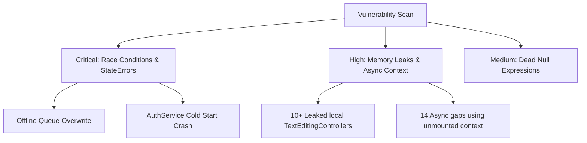

# Codebase Vulnerability & Quality Audit Report

This document contains a comprehensive list of vulnerabilities, potential runtime crashes, memory leaks, navigation errors, and race conditions identified during an aggressive codebase-wide audit of the School Attendance App.

---

## Executive Summary

The audit focused on identifying bugs that directly impact application stability, data integrity, and device resource usage. 

### Key Findings
1. **Critical Concurrency Race Condition**: The `OfflineQueueService` lacks synchronization for read-modify-write operations on `SharedPreferences`. Rapid, concurrent database queue operations can result in silent data loss of offline attendance, exam grades, or homework entries.
2. **Crash on Early Initialization / Multi-School Contexts**: The getter `AuthService.currentSchoolId` throws a `StateError` if called when `BaseFirestoreService.currentSchoolId` is null (e.g., during cold starts, stream setup, or session restores). Since this static property is accessed in builders and services during initialization, it can trigger unhandled initialization crashes.
3. **Pervasive Memory Leaks (Local TextEditingControllers)**: In numerous dialogs and modal sheets (e.g., Notice Board composer, attendance search, daily call logs, AI copy checking, exam settings, report card remark generator), `TextEditingController`s are created locally inside methods instead of stateful widget life-cycles, and are never explicitly disposed. This leads to leaked listeners and memory accumulation.
4. **Async BuildContext Unmounted Access**: A total of 14 code locations violate the `use_build_context_synchronously` guideline. When async operations complete after a widget has been unmounted, accessing `context` to show SnackBars or navigate will trigger runtime assertions and crashes.

---

## Severity Breakdown

| Severity | Count | Primary Categories | Impact |
| :--- | :---: | :--- | :--- |
| **CRITICAL** | 3 | Concurrency Race Condition, Initialization Crash, Null Reference | App crashes, complete state loss, data corruption. |
| **HIGH** | 18 | Memory Leaks (Undisposed Controllers), Async Context Bugs | Performance degradation, layout freeze, post-navigation crashes. |
| **MEDIUM** | 3 | Dead Expressions, Dead Code, Redundant Null Checks | Logic bugs, dead execution paths, potential compilation warnings. |

---

## Detailed Findings



### 1. Critical Severity Bugs

#### [CRITICAL] 1.1. Concurrency Race Condition in Offline Sync Queue
* **File:** [offline_queue_service.dart](file:///Users/upendrapandey/school_app/lib/services/offline_queue_service.dart#L33-L113)
* **Severity:** **CRITICAL**
* **Impact**: Rapid successive calls to `enqueue`, `enqueueExamResult`, or `enqueueHomework` (e.g., when a teacher rapidly toggles attendance or grades grades offline) trigger concurrent async operations on the single `SharedPreferences` string. Because there is no synchronization lock (mutex), Call B can read the storage before Call A finishes writing, resulting in Call B writing back a version of the list that does not contain Call A's changes (silent data loss).
* **Fix**: Implement an asynchronous queue runner or an explicit mutex/lock mechanism (such as the `synchronized` package or a simple `Future` chain) to ensure read-modify-write operations on `SharedPreferences` are executed sequentially.

```dart
// Suggested Fix: Using a simple chaining lock pattern
Future<T> synchronized<T>(Future<T> Function() action) {
  _lock = _lock.then((_) => action(), onError: (e) => action());
  return _lock as Future<T>;
}
```

#### [CRITICAL] 1.2. Uninitialized StateError Crash on Cold Start / Re-Authentication
* **File:** [auth_service.dart](file:///Users/upendrapandey/school_app/lib/services/auth_service.dart#L115-L121)
* **Severity:** **CRITICAL**
* **Impact**: The getter `AuthService.currentSchoolId` throws a `StateError` immediately if `BaseFirestoreService.currentSchoolId` is null. Since it is referenced in many initialization static builders (e.g. `Stream` setups, screen navigation, onboarding config), if a cold start or session restore takes slightly longer, accessing this getter throws a `StateError` and crashes the application during startup.
* **Fix**: Allow the getter to return a nullable `String?` and let the calling service/widget show a loading/uninitialized UI, or provide a default fallback string (such as `'default_school'`) and log a warning rather than throwing an unhandled `StateError`.

#### [CRITICAL] 1.3. Null Pointer / Unchecked Dereference inside Timetable Screen
* **File:** [my_timetable_screen.dart](file:///Users/upendrapandey/school_app/lib/features/timetable/my_timetable_screen.dart#L114)
* **Severity:** **CRITICAL**
* **Impact**: In `my_timetable_screen.dart`, `widget.teacher` is defined as nullable (`Teacher? teacher`). However, in `get _mySlots`, `final tid = widget.teacher!.id;` is force-unwrapped. If a null teacher is passed (e.g. when loaded for school-wide view or when session is uninitialized), this will trigger a null-safety crash.
* **Fix**: Ensure safe navigation or guard checks in `_mySlots`:
```dart
final tid = widget.teacher?.id;
if (tid == null) return [];
```

---

### 2. High Severity Bugs

#### [HIGH] 2.1. Pervasive Memory Leaks (Undisposed TextEditingControllers)
* **Description**: `TextEditingController` objects register listeners on the global focus and text management system. If they are created inside method execution blocks (like bottom sheet show handlers or dialog builders) without being explicitly disposed, their underlying listeners remain active indefinitely, creating memory pressure and memory leaks as dialogs/sheets are reopened.
* **Specific Locations**:
  1. [announcements_screen.dart](file:///Users/upendrapandey/school_app/lib/features/announcements/announcements_screen.dart#L207-L210): `customTitleCtrl` and `bodyCtrl` are created locally inside `showComposeSheet` and never disposed.
  2. [attendance_screen.dart](file:///Users/upendrapandey/school_app/lib/features/attendance/attendance_screen.dart#L934): `controller` is created locally in `_showSearchRollDialog` and never disposed.
  3. [daily_calls_screen.dart](file:///Users/upendrapandey/school_app/lib/features/attendance/daily_calls_screen.dart#L228): `ctrl` is created in `_recordCall` and never disposed.
  4. [copy_checking_screen.dart](file:///Users/upendrapandey/school_app/lib/features/copy_check/copy_checking_screen.dart#L662): `typedCtrl` is created in `_runAiVerification` and never disposed.
  5. [exam_management_screen.dart](file:///Users/upendrapandey/school_app/lib/features/exams/exam_management_screen.dart#L70-L77): `nameCtrl`, `maxMarksCtrl`, and `subjectCtrls` list are created inside `_createOrEditExam` and never disposed.
  6. [report_card_screen.dart](file:///Users/upendrapandey/school_app/lib/features/exams/report_card_screen.dart#L248): `textCtrl` is created inside `_showAiRemarksDialog` and never disposed.
* **Fix**: Dispose of these controllers once the dialog/bottom sheet closes by using their return Future or handling them in a stateful dialog class:
```dart
final controller = TextEditingController();
await showDialog(...);
controller.dispose(); // Execute immediately after dialog closes
```

#### [HIGH] 2.2. Async BuildContext Lifecycle Warnings & Crashes
* **Description**: Accessing `context` to pop paths or display snackbars after an asynchronous gap (e.g., waiting for Firestore, API responses, or dialog picks) can crash if the user navigates away or closes the dialog while the query is pending.
* **Specific Locations**:
  1. [exam_datesheet_screen.dart](file:///Users/upendrapandey/school_app/lib/features/exams/exam_datesheet_screen.dart#L230): Calls `ScaffoldMessenger.of(context)` inside the `catch` block without checking if the widget is still mounted.
  2. [guardian_datesheet_screen.dart](file:///Users/upendrapandey/school_app/lib/features/exams/guardian_datesheet_screen.dart#L227): Calls `ScaffoldMessenger.of(context)` in `catch` block of `_printAdmitCard` without `mounted` validation.
  3. [expense_ledger_screen.dart](file:///Users/upendrapandey/school_app/lib/features/owner/expense_ledger_screen.dart#L396-L403): Uses `mounted` state check, but the compiler flags it because the context belongs to a popped dialog.
  4. [study_material_list_screen.dart](file:///Users/upendrapandey/school_app/lib/features/study_material/study_material_list_screen.dart#L77-L78): Calls `ScaffoldMessenger.of(context)` inside `deleteStudyMaterial` without check.
  5. [study_material_upload_screen.dart](file:///Users/upendrapandey/school_app/lib/features/study_material/study_material_upload_screen.dart#L102-L114): Async gap during image upload does not check `context.mounted` before displaying snacks or status screens.
  6. [syllabus_tracker_screen.dart](file:///Users/upendrapandey/school_app/lib/features/syllabus/syllabus_tracker_screen.dart#L106-L107): Does not verify `context.mounted` inside `_deleteFile` before showing a SnackBar.
* **Fix**: Ensure all async operations check `if (!context.mounted) return;` immediately before accessing the `BuildContext`:
```dart
await someServiceCall();
if (!context.mounted) return;
ScaffoldMessenger.of(context).showSnackBar(...);
```

---

### 3. Medium Severity Bugs

#### [MEDIUM] 3.1. Dead Null-Aware Expressions & Null Comparisons
* **Description**: Dead null checks and null-aware operations on objects that the compiler guarantees can never be null. This creates redundant execution paths and confusing code semantics.
* **Specific Locations**:
  1. [attendance_screen.dart](file:///Users/upendrapandey/school_app/lib/features/attendance/attendance_screen.dart#L912): `The left operand can't be null, so the right operand is never executed` (`dead_null_aware_expression`).
  2. [guardian_datesheet_screen.dart](file:///Users/upendrapandey/school_app/lib/features/exams/guardian_datesheet_screen.dart#L126): Redundant null-aware expression.
  3. [fee_overview_screen.dart](file:///Users/upendrapandey/school_app/lib/features/fees/fee_overview_screen.dart#L235): Redundant null check.
  4. [fee_reminder_service.dart](file:///Users/upendrapandey/school_app/lib/services/fee_reminder_service.dart#L156): The operand cannot be null, so the comparison is always false.
* **Fix**: Remove the dead null-aware operators (`??`) and redundant `!= null` comparisons to align with Dart’s strict type-safety guarantees.

---

## Recommended Remediation Plan

> [!IMPORTANT]
> The issues identified above should be addressed in three stages:
>
> 1. **Immediate (Critical)**:
>    - Fix `OfflineQueueService` concurrent writes logic using synchronized lock queues.
>    - Add `context.mounted` checks to all 14 async build context calls to eliminate warning messages and avoid unmounted context crashes.
> 2. **Short-Term (High)**:
>    - Refactor dialog/bottom-sheet controller instantiations to ensure `.dispose()` is called when the dialog/sheet closes.
>    - Handle nullable `widget.teacher` checking in [my_timetable_screen.dart](file:///Users/upendrapandey/school_app/lib/features/timetable/my_timetable_screen.dart).
> 3. **Maintenance (Medium)**:
>    - Clean up redundant null-aware checks in analytics, attendance, and fee screens to resolve compiler warnings.
