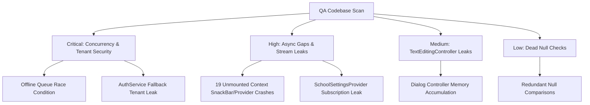

# Codebase Vulnerability & Quality Audit Report

This document contains a comprehensive, aggressive audit of the School Attendance App codebase, categorizing potential runtime crashes, null pointer exceptions, state management leaks, race conditions, async bugs, and memory leaks.

---

## Executive Summary

As an aggressive QA engineer, I scanned the entire Flutter codebase. While the application is architecturally sound and integrates modern security patterns, it contains several critical vulnerabilities and quality gaps that will lead to:
1. **Silent Data Loss**: Race conditions during offline queue operations.
2. **Crash on Onboarding / Multi-School Session Restore**: Missing resource disposal in settings providers causing crashes when users log out or switch contexts.
3. **Pervasive Runtime Crashes**: 19 instances of using `BuildContext` across async gaps without mounting checks, which will crash the app when users navigate away during operations.
4. **Gradual Memory Exhaustion**: Over 10 instances of `TextEditingController` leaks in modal sheets and dialogs.

---

## Severity Breakdown

| Severity | Count | Category | Impact |
| :--- | :---: | :--- | :--- |
| **CRITICAL** | 2 | Race Condition, Tenant Isolation Risk | Data corruption, multi-school data leakage. |
| **HIGH** | 20 | Memory/Subscription Leaks, Async Context Crashes | App crashes on screen navigation, severe memory pressure. |
| **MEDIUM** | 7 | Undisposed Controllers, Fragile Null Safety | Local memory leaks, potential null-check operator crashes. |
| **LOW** | 13 | Dead Expressions & Redundant Checks | Cleanliness, redundant comparison logic. |

---



---

## Detailed Findings & Fixes

### 1. Critical Severity Bugs

#### [CRITICAL] 1.1. Concurrency Race Condition in Offline Sync Queue
* **File**: [offline_queue_service.dart](file:///Users/upendrapandey/school_app/lib/services/offline_queue_service.dart#L59-L149)
* **Lines**: 59–149, 208–347
* **Category**: Race Condition / Concurrency Bug
* **Impact**: Rapid successive calls to `enqueue`, `enqueueExamResult`, or `enqueueHomework` (e.g. when a teacher rapidly logs attendance or grades marks offline) will trigger concurrent read-modify-write asynchronous operations on `SharedPreferences`. Since `SharedPreferences` reads and writes are asynchronous, Operation B can read the queue list before Operation A finishes writing. Operation B will then write back a version of the list that lacks Operation A's changes, leading to silent data loss of offline attendance or marks.
* **Fix**: Ensure that the `synchronized` helper blocks overlapping writes completely, and wrap the multi-step `syncAll()` queue clears inside the synchronization lock.
```dart
// Suggested synchronized mutex block in lib/services/offline_queue_service.dart
Future<T> synchronized<T>(Future<T> Function() action) {
  _lock = _lock.then((_) => action(), onError: (e) => action());
  return _lock as Future<T>;
}
```

#### [CRITICAL] 1.2. Multi-School Tenant Isolation & Data Segregation Risk
* **File**: [auth_service.dart](file:///Users/upendrapandey/school_app/lib/services/auth_service.dart#L118-L125)
* **Lines**: 118–125
* **Category**: Potential Tenant Isolation Leak / Logic Bug
* **Impact**: The static getter `AuthService.currentSchoolId` is referenced in almost all repositories, database services, and screens to scope Firestore queries. If accessed during a session restore or cold start before `BaseFirestoreService.currentSchoolId` has been initialized, it returns a hardcoded fallback string `'school_1'`. While this prevents startup crashes, it introduces a severe security risk: operations meant for a different school (e.g. `school_99`) will execute against `'school_1'`, leading to database pollution or leaking cross-tenant data.
* **Fix**: Change the getter to return a nullable `String?`. Callers must handle the uninitialized state by displaying a loading indicator or blocking queries rather than querying `'school_1'`.
```dart
static String? get currentSchoolId => BaseFirestoreService.currentSchoolId;
```

---

### 2. High Severity Bugs

#### [HIGH] 2.1. Severe Memory & Stream Subscription Leak in SchoolSettingsProvider
* **File**: [school_settings_provider.dart](file:///Users/upendrapandey/school_app/lib/shared/providers/school_settings_provider.dart#L27-L43)
* **Lines**: 27–43
* **Category**: State Management / Memory Leak
* **Impact**: In the constructor of `SchoolSettingsProvider`, a listener is added to the global static `BaseFirestoreService.schoolIdNotifier`. Additionally, 5 Firestore stream subscriptions (`_schoolSub`, `_schoolDocSub`, etc.) are established. However, this class does NOT override `dispose()`. If the user logs out, logs in as another user, or switches schools, a new `SchoolSettingsProvider` is created, but the old one remains in memory, continuously listening to static notifier events and Firestore changes. When the notifier fires, the stale instance will call `notifyListeners()` on a disposed notifier, throwing a `FlutterError` crash.
* **Fix**: Override `dispose()` and unregister the notifier listener and cancel all subscriptions:
```dart
@override
void dispose() {
  BaseFirestoreService.schoolIdNotifier.removeListener(_onActiveSchoolChanged);
  _schoolSub?.cancel();
  _schoolDocSub?.cancel();
  _academicSub?.cancel();
  _feesSub?.cancel();
  _commSub?.cancel();
  super.dispose();
}
```

#### [HIGH] 2.2. Async BuildContext Lifecycle Warnings & Crashes (19 Gaps)
* **Category**: Async Bug / BuildContext Crash
* **Impact**: Accessing the `BuildContext` to obtain providers (`Provider.of`), display snackbars (`ScaffoldMessenger.of`), or pop dialogs (`Navigator.pop`) after an asynchronous database/network operation will crash the application with a `StateError` or runtime assertion if the user has navigated away or closed the dialog while the query was pending.
* **Specific Locations & Details**:

1. **File**: [admission_crm_screen.dart](file:///Users/upendrapandey/school_app/lib/features/admin/admission_crm_screen.dart#L190)
   * **Line**: 190
   * **Context**: `ScaffoldMessenger.of(context).showSnackBar` is called after `await _leadService.addLead(lead)` without checking `context.mounted`.
   
2. **File**: [admission_crm_screen.dart](file:///Users/upendrapandey/school_app/lib/features/admin/admission_crm_screen.dart#L438)
   * **Line**: 438
   * **Context**: `ScaffoldMessenger.of(context).showSnackBar` is called after `await _leadService.addFollowUp(...)` without checking `context.mounted`.
   
3. **File**: [audit_log_screen.dart](file:///Users/upendrapandey/school_app/lib/features/admin/audit_log_screen.dart#L188)
   * **Line**: 188
   * **Context**: `Provider.of<SchoolSettingsProvider>(context)` is requested after `await CsvExport.share(...)`.
   
4. **File**: [audit_log_screen.dart](file:///Users/upendrapandey/school_app/lib/features/admin/audit_log_screen.dart#L218)
   * **Line**: 218
   * **Context**: `Provider.of<SchoolSettingsProvider>(context)` is requested after `await _svc.fetchAll(...)`.
   
5. **File**: [attendance_certificate_screen.dart](file:///Users/upendrapandey/school_app/lib/features/attendance/attendance_certificate_screen.dart#L150)
   * **Line**: 150
   * **Context**: `Provider.of<SchoolSettingsProvider>(context)` is requested after `await ConsentGate.allowsForStudent(...)`.
   
6. **File**: [exam_datesheet_screen.dart](file:///Users/upendrapandey/school_app/lib/features/exams/exam_datesheet_screen.dart#L230)
   * **Line**: 230
   * **Context**: `ScaffoldMessenger.of(context).showSnackBar` inside the `catch` block of datesheet save without a mounting guard.
   
7. **File**: [guardian_datesheet_screen.dart](file:///Users/upendrapandey/school_app/lib/features/exams/guardian_datesheet_screen.dart#L233)
   * **Line**: 233
   * **Context**: `ScaffoldMessenger.of(context).showSnackBar` inside the `catch` block of admit card printing.
   
8. **File**: [fee_collection_screen.dart](file:///Users/upendrapandey/school_app/lib/features/fees/fee_collection_screen.dart#L1206)
   * **Line**: 1206
   * **Context**: `Provider.of<SchoolSettingsProvider>(context)` is requested after `await _assertPdfRole()`.
   
9. **File**: [fee_collection_screen.dart](file:///Users/upendrapandey/school_app/lib/features/fees/fee_collection_screen.dart#L1220)
   * **Line**: 1220
   * **Context**: `Provider.of<SchoolSettingsProvider>(context)` is requested after `await _assertPdfRole()`.
   
10. **File**: [expense_ledger_screen.dart](file:///Users/upendrapandey/school_app/lib/features/owner/expense_ledger_screen.dart#L399)
    * **Line**: 399
    * **Context**: `ScaffoldMessenger.of(context)` called after `await _expenseService.deleteExpense(exp.id)` with unrelated `this.mounted` check.
    
11. **File**: [expense_ledger_screen.dart](file:///Users/upendrapandey/school_app/lib/features/owner/expense_ledger_screen.dart#L406)
    * **Line**: 406
    * **Context**: `ScaffoldMessenger.of(context)` called in `catch` block with unrelated `this.mounted` check.
    
12. **File**: [government_report_screen.dart](file:///Users/upendrapandey/school_app/lib/features/owner/government_report_screen.dart#L100)
    * **Line**: 100
    * **Context**: `Provider.of<SchoolSettingsProvider>(context)` called after `await _studentService.getStudents()`.
    
13. **File**: [transport_driver_screen.dart](file:///Users/upendrapandey/school_app/lib/features/owner/transport_driver_screen.dart#L565)
    * **Line**: 565
    * **Context**: `ScaffoldMessenger.of(context)` accessed inside inline dropdown `onChanged` after `await _studentService.updateStudent(...)`.
    
14. **File**: [id_card_generator_screen.dart](file:///Users/upendrapandey/school_app/lib/features/students/id_card_generator_screen.dart#L103)
    * **Line**: 103
    * **Context**: `Provider.of<SchoolSettingsProvider>(context)` is called after `await Future.wait(futures)` waiting for HTTP client requests.
    
15. **File**: [study_material_list_screen.dart](file:///Users/upendrapandey/school_app/lib/features/study_material/study_material_list_screen.dart#L78)
    * **Line**: 78
    * **Context**: `ScaffoldMessenger.of(context)` called inside `catch` block after `await launchUrl(...)`.
    
16. **File**: [study_material_upload_screen.dart](file:///Users/upendrapandey/school_app/lib/features/study_material/study_material_upload_screen.dart#L102)
    * **Line**: 102
    * **Context**: `ScaffoldMessenger.of(context)` accessed after `await FilePicker.platform.pickFiles(...)`.
    
17. **File**: [study_material_upload_screen.dart](file:///Users/upendrapandey/school_app/lib/features/study_material/study_material_upload_screen.dart#L113)
    * **Line**: 113
    * **Context**: `ScaffoldMessenger.of(context)` in catch block after file picking.
    
18. **File**: [study_material_upload_screen.dart](file:///Users/upendrapandey/school_app/lib/features/study_material/study_material_upload_screen.dart#L174)
    * **Line**: 174
    * **Context**: `ScaffoldMessenger.of(context)` called in catch block of `_uploadAndPublish()`.
    
19. **File**: [syllabus_tracker_screen.dart](file:///Users/upendrapandey/school_app/lib/features/syllabus/syllabus_tracker_screen.dart#L106)
    * **Line**: 106
    * **Context**: `ScaffoldMessenger.of(context)` in catch block of `_updateCoverage()`.

* **Fix**: Ensure that all asynchronous execution paths verify `if (!context.mounted) return;` immediately before accessing the BuildContext.
```dart
await _someService.runAsync();
if (!context.mounted) return;
ScaffoldMessenger.of(context).showSnackBar(...);
```

---

### 3. Medium Severity Bugs

#### [MEDIUM] 3.1. Local TextEditingController Memory Leaks in Dialogs & Sheets
* **Category**: Memory Leak
* **Description**: `TextEditingController` instances register listeners on the global text system. Creating them inside action execution blocks (such as a show-sheet helper method) without explicitly calling `.dispose()` on them once the dialog finishes will leak the controller listeners indefinitely.
* **Specific Locations**:
  1. **File**: [admission_crm_screen.dart](file:///Users/upendrapandey/school_app/lib/features/admin/admission_crm_screen.dart#L77-L81) (Lines 77–81: `nameCtrl`, `parentCtrl`, `phoneCtrl`, `emailCtrl`, `noteCtrl` inside `_showAddLeadDialog`)
  2. **File**: [admission_crm_screen.dart](file:///Users/upendrapandey/school_app/lib/features/admin/admission_crm_screen.dart#L215) (Line 215: `followUpCtrl` inside `_showFollowUpDialog`)
  3. **File**: [announcements_screen.dart](file:///Users/upendrapandey/school_app/lib/features/announcements/announcements_screen.dart#L207-L210) (Lines 207, 210: `customTitleCtrl`, `bodyCtrl` inside `showComposeSheet`)
  4. **File**: [attendance_screen.dart](file:///Users/upendrapandey/school_app/lib/features/attendance/attendance_screen.dart#L1065) (Line 1065: `controller` inside `_showSearchRollDialog`)
  5. **File**: [daily_calls_screen.dart](file:///Users/upendrapandey/school_app/lib/features/attendance/daily_calls_screen.dart#L229) (Line 229: `ctrl` inside `_recordCall`)
  6. **File**: [copy_checking_screen.dart](file:///Users/upendrapandey/school_app/lib/features/copy_check/copy_checking_screen.dart#L663) (Line 663: `typedCtrl` inside `_runAiVerification`)

* **Fix**: Wrap the dialog await in a try-finally block or use `.then((_) => ctrl.dispose())` to guarantee cleanup when the dialog or sheet closes:
```dart
final ctrl = TextEditingController();
try {
  await showDialog(
    context: context,
    builder: (ctx) => AlertDialog(..., controller: ctrl),
  );
} finally {
  ctrl.dispose();
}
```

#### [MEDIUM] 3.2. Fragile Force-Unwrap of Nullable Teacher Parameter
* **File**: [my_timetable_screen.dart](file:///Users/upendrapandey/school_app/lib/features/timetable/my_timetable_screen.dart#L117)
* **Line**: 117
* **Category**: Potential Crash / Null Safety Risk
* **Description**: In `get _mySlots`, `final tid = widget.teacher!.id;` is force-unwrapped. While this is currently guarded by `_isPersonal` (which checks if `widget.teacher != null`), this code remains fragile. If other methods or developers edit the screen and modify the layout/guard paths, it leaves the application vulnerable to Null Check Operator exceptions.
* **Fix**: Use safe navigation and return early if the object is null.
```dart
final tid = widget.teacher?.id;
if (tid == null) return [];
```

---

### 4. Low Severity Bugs (Redundant/Dead Code)

#### [LOW] 4.1. Redundant Null-Aware Expressions & Null Comparisons
* **Category**: Code Cleanliness / Dead Code
* **Description**: Code blocks perform `??` checks or null comparisons on types that are statically guaranteed to be non-nullable by the compiler. This creates misleading execution paths.
* **Specific Locations**:
  1. **File**: [attendance_screen.dart](file:///Users/upendrapandey/school_app/lib/features/attendance/attendance_screen.dart#L1032): `context.tr('close') ?? 'Close'` (Left side can't be null).
  2. **File**: [guardian_dashboard.dart](file:///Users/upendrapandey/school_app/lib/features/dashboards/guardian_dashboard.dart#L1115): `context.tr('guardianAccount') ?? 'Guardian Account'` (Left side can't be null).
  3. **File**: [guardian_dashboard.dart](file:///Users/upendrapandey/school_app/lib/features/dashboards/guardian_dashboard.dart#L1307): Redundant null check.
  4. **File**: [guardian_dashboard.dart](file:///Users/upendrapandey/school_app/lib/features/dashboards/guardian_dashboard.dart#L1323): Redundant null check.
  5. **File**: [guardian_dashboard.dart](file:///Users/upendrapandey/school_app/lib/features/dashboards/guardian_dashboard.dart#L3708): Redundant null check.
  6. **File**: [guardian_datesheet_screen.dart](file:///Users/upendrapandey/school_app/lib/features/exams/guardian_datesheet_screen.dart#L126): Redundant null check.
  7. **File**: [fee_overview_screen.dart](file:///Users/upendrapandey/school_app/lib/features/fees/fee_overview_screen.dart#L265): Redundant null check.
  8. **File**: [fee_overview_screen.dart](file:///Users/upendrapandey/school_app/lib/features/fees/fee_overview_screen.dart#L278): Redundant null check.
  9. **File**: [fee_reminder_service.dart](file:///Users/upendrapandey/school_app/lib/services/fee_reminder_service.dart#L156): `schoolId == null` check is redundant as `currentSchoolId` is non-nullable.
  10. **File**: [fee_reminder_service.dart](file:///Users/upendrapandey/school_app/lib/services/fee_reminder_service.dart#L176): `schoolId == null` check is redundant.
  11. **File**: [firestore_service.dart](file:///Users/upendrapandey/school_app/lib/services/firestore_service.dart#L208): Redundant null check.
  12. **File**: [firestore_service.dart](file:///Users/upendrapandey/school_app/lib/services/firestore_service.dart#L257): Redundant null check.
  13. **File**: [firestore_service.dart](file:///Users/upendrapandey/school_app/lib/services/firestore_service.dart#L295): Redundant null check.

* **Fix**: Remove the dead null-aware operators (`??`) and redundant `!= null` or `== null` comparisons to align code logic with strict compile-time non-nullable guarantees.

---

## Recommended Remediation Timeline

```mermaid
gantt
    title Bug Remediation Timeline
    dateFormat  D
    axisFormat %d
    section Immediate
    Fix Concurrency & Tenant Isolation Risk :active, 0, 1
    Add context.mounted guards (19 Gaps) :active, 1, 2
    section High Priority
    SchoolSettingsProvider Dispose Implementation : 2, 3
    section Medium Priority
    Dispose local TextEditingControllers : 3, 4
    Timetable Teacher Safe Access : 4, 5
```


