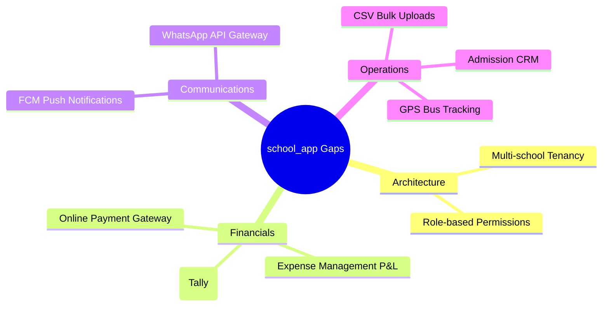

# Competitor Analysis & Strategic Product Report
## Detailed Market Analysis and Feature Prioritization for `school_app`

---

## 1. Executive Summary

This report provides a comprehensive analysis of the competitive landscape for **School App** (`school_app`). It evaluates its features, architecture, and workflows against leading domestic and global school ERP/LMS solutions, including **Entab CampusCare**, **Fedena**, **Vidyalaya ERP**, **LEAD School**, **Toddle**, and **PowerSchool**.

While `school_app` offers an excellent initial foundation for single-school operations (attendance, timetable, basic homework, and grades), transitioning it into a scalable SaaS platform requires resolving structural deficiencies and closing high-value functional gaps.

Key strategic recommendations include:
1. **Multi-Tenancy:** Decouple hardcoded single-school schema constructs to allow multi-tenant isolation.
2. **Onboarding Automation:** Replace student-by-student additions with bulk CSV/Excel parsing and invite-code student-guardian bindings.
3. **Workflow Simplification:** Redesign core screens (e.g., Attendance) to operate on an exceptions-only basis rather than page-by-page swiping.
4. **Monetization Realization:** Introduce online payment flows (UPI, Razorpay) and capture transaction convenience fees or subscription tiers.

---

## 2. Competitor Landscape

The school management software market consists of three main segments:
1. **Regional Legacy ERPs (India-focused):** Heavy administrative features, localized integrations, manual high-touch onboarding.
2. **Integrated Curriculum Systems (EaaS):** Comprehensive academic delivery models (e.g., LEAD School's "School-in-a-box").
3. **Global LMS/SIS Platforms:** Highly polished, pedagogy-first systems with open API architectures (e.g., Toddle, PowerSchool).

### Competitive Matrix

| Competitor | Target Segment | Core Technical Strengths | Monetization Model | Onboarding Approach |
| :--- | :--- | :--- | :--- | :--- |
| **Entab (CampusCare)** | Premium schools (CBSE/ICSE) | NEP 2020 compliance, detailed 360° progress reports, GPS transport integration. | Custom Annual Contract (Per-student fee) + Annual Maintenance Charges (AMC). | High-Touch (2–12 weeks). Guided manual data migration by technical teams. |
| **Fedena** | Mid-market & Multi-branch | Modular plugin system, Tally financial integration, open-source core, robust API integrations. | SaaS Subscription (₹25k–₹100k+/year based on active plugins and size) + setup fees. | Hybrid. Guided setup wizard for standard school configurations (batches/courses). |
| **Vidyalaya ERP** | Budget & Tier-2/3 schools | High offline capabilities, low-bandwidth optimization, pre-built template configs. | Low-cost flat annual license (starting at ~₹7,500/year). High volume, low margin. | Rapid. Call-based CSV data mapping and instant bulk upload tools. |
| **LEAD School** | Private schools in Tier-2/3/4 | "School-in-a-box": integration of curriculum, teacher training, and ERP tech. | **Education-as-a-Service (EaaS)**: 8%–12% revenue share of school fees collected. | Intensive Enterprise Partnership. Deploying on-site training consultants. |
| **Toddle** | Premium International (IB/Cambridge) | Pedagogy-first LMS, AI-assisted unit planning/grading, parent portfolios, modern clean UI. | Tiered SaaS Subscription (Per-student-per-year licensing fee). | Self-serve to Guided. Pre-configured templates, extensive documentation & video guides. |
| **PowerSchool** | Enterprise/State K-12 | Comprehensive Student Information System (SIS) with extensive ecosystem integrations. | Enterprise SaaS Licensing. Add-on pricing for analytics and third-party plugins. | High-Touch. Professional services team handles deployment, data mapping, and testing. |

---

## 3. Product Gap Analysis vs. `school_app`

### 3.1 Missing Features

Based on code-level research of `school_app`'s services, the following premium features are completely missing:



1. **Multi-Tenancy Layer:**
   * *Gap:* The database writes to collections assuming a single tenant (hardcoded as `school_1` in some services, e.g., [GalleryService](file:///Users/upendrapandey/school_app/lib/services/gallery_service.dart)).
   * *Competitor Benchmark:* Both Fedena and PowerSchool utilize multi-tenant architectures, shielding tenant spaces by organizing under `schools/{schoolId}/...` or tenant routing databases.
2. **Native Payment Gateway Integration:**
   * *Gap:* [FeeService](file:///Users/upendrapandey/school_app/lib/services/fee_service.dart) only logs payments manually (Cash, Cheque, UPI offline). There is no automated gateway (Razorpay, Paytm, Stripe) for real-time checkout and automated digital reconciliation.
   * *Competitor Benchmark:* Almost all competitors (Entab, Fedena, Vidyalaya) have payment portal configurations enabling automatic receipts and immediate ledger updates.
3. **Automated Notification Triggers:**
   * *Gap:* [NotificationService](file:///Users/upendrapandey/school_app/lib/services/notification_service.dart) acts as a passive polling collection. Absent notifications are manual sharing triggers via WhatsApp intents instead of automated server-side FCM (Firebase Cloud Messaging) or SMS gateway events.
   * *Competitor Benchmark:* Toddle and ClassDojo send instant push alerts to parent portals, while regional ERPs trigger immediate automated SMS templates for absentees.
4. **Transport & GPS Bus Tracking:**
   * *Gap:* Guardians have no way to monitor school transport.
   * *Competitor Benchmark:* Entab and Vidyalaya feature real-time bus tracking using low-cost GPS devices or a driver-side application, sending automated push alerts as buses near the student's stop.
5. **Admission CRM & Lead Pipeline:**
   * *Gap:* No tracking for inquiries, interviews, document verification, or registration status.
   * *Competitor Benchmark:* Dedicated CRM pipelines manage admission funnels to convert public inquiries into enrollments.
6. **Expense Tracking & School Profitability (P&L):**
   * *Gap:* The app records student revenue but lacks expense ledgers (e.g., salaries, utilities, maintenance) for the principal or coordinator to monitor profitability.
7. **Tally Accounting Sync:**
   * *Gap:* Large schools use Tally or SAP for auditing. The app cannot export standard financial ledgers, leading to double-entry errors.

---

### 3.2 Workflow Optimizations

We identified several high-friction workflows in the application codebase compared to modern competitor architectures:

#### 1. Attendance Marking Model
* **Current Friction:** [attendance_screen.dart](file:///Users/upendrapandey/school_app/lib/screens/attendance_screen.dart) displays students in a vertical `PageView`. For a class of 40-50, a teacher must swipe and tap 40+ times.
* **Competitor Benchmark:** Modern ERPs show a scrollable grid or list. By default, all students are marked **Present**. The teacher only taps to toggle **Absent** or **Leave** exceptions, reducing the interaction count from $O(N)$ to $O(E)$ (where $E$ is the number of absentees).
* **Workflows Comparison:**
  ```mermaid
  graph LR
      subgraph Current (school_app)
          A[Start] --> B[Swipe Card]
          B --> C[Tap status]
          C --> D{Next student?}
          D -- Yes --> B
          D -- No --> E[Submit]
      end
      subgraph Optimized (Competitors)
          F[Start] --> G[View full list]
          G --> H[Toggle Absent exceptions]
          H --> I[Save]
      end
  ```

#### 2. Leave Approval Integration
* **Current Friction:** Approving leaves in [leave_requests_screen.dart](file:///Users/upendrapandey/school_app/lib/screens/leave_requests_screen.dart) does not automatically write to the attendance register. Teachers must manually mark that student as "Leave" on the class attendance screen.
* **Competitor Benchmark:** Leave approval automatically inserts a "Leave" status placeholder in the attendance ledger for the requested dates, preventing teachers from overriding or duplicate-calling parents.

#### 3. Phone Call Feedback Logging
* **Current Friction:** [daily_calls_screen.dart](file:///Users/upendrapandey/school_app/lib/screens/daily_calls_screen.dart) allows calling guardians of absentees, but there is no mechanism to log outcomes (e.g., "Sick", "No Response").
* **Competitor Benchmark:** A popup modal intercepts the app return, prompting the teacher/coordinator to log call outcomes, which immediately synchronizes with the student's daily report card.

---

### 3.3 Onboarding Enhancements

ERP migration failures often happen due to complex, high-touch onboarding steps. Here is how `school_app` can implement modern onboarding practices:

1. **Wizard State Persistence:**
   * *Problem:* If the admin/coordinator closes the onboarding flow mid-step, they lose all progress.
   * *Solution:* Cache state on every step using local storage (`SharedPreferences`) or create a `draft_schools` schema in Firestore.
2. **Bulk Student & Timetable Import:**
   * *Problem:* Adding students one-by-one is tedious.
   * *Solution:* Leverage the `csv` package to parse class rosters and timetables from CSV files, batch-writing them directly to Firestore.
3. **Automated Parent Association:**
   * *Problem:* Coordinators must manually type and link phone numbers in `allowed_users`.
   * *Solution:* Autogenerate a secure 6-character registration token for each student profile. Parents enter this token on sign-up to automatically bind to the student's record, reducing admin data entry.

---

## 4. Monetization Strategies

To turn `school_app` into a revenue-generating platform, we analyze four major monetization pathways:

### Option A: Per-Student SaaS Subscription (SaaS)
* **Description:** Monthly or annual licensing fees charged to the school based on active enrollment.
* **Pricing Tiers:**
  * **Basic (₹15 / student / month):** Core attendance, timetables, and announcement features.
  * **Pro (₹35 / student / month):** Includes exam reports, homework management, and digital fee logging.
  * **Enterprise (₹65 / student / month):** Adds multi-school management, automated push notifications, and analytics dashboards.
* **Pros:** Highly predictable, compounding recurring revenue.
* **Cons:** Longer sales cycles, high customer acquisition costs.

### Option B: Payment Gateway Convenience Fee Split (Transaction-based)
* **Description:** Offer the software at near-cost (or free basic tier), but charge a small transaction fee (e.g., 0.5% to 1.5% convenience fee) on digital fee collections made through the app.
* **Pros:** Extremely low barrier to entry for budget-conscious schools; aligns costs directly with school utility.
* **Cons:** Seasonal revenue peaks (highly concentrated during quarterly fee collections).

### Option C: Parent-Paid Value-Added Services (Freemium)
* **Description:** Free core portal for schools. Parents pay a small subscription (e.g., ₹250/year) to unlock premium features:
  * Real-time GPS bus tracking.
  * AI-powered study progress metrics and personalized learning assistance.
  * Premium, exportable report card designs.
* **Pros:** Removes financial burden from the school administration.
* **Cons:** High friction to acquire parent subscriptions; risks dividing student access based on economic status.

---

## 5. Feature Prioritization Framework

To guide implementation, we rank proposed features by **Business Impact** (retention, conversion, revenue potential) and **Development Effort** (S: Days, M: Weeks, L: Months).

### Priority Matrix

```
   HIGH  |----------------------------------------------------|
         | [Quick Wins]                                       | [Strategic Initiatives]
         | 1. Bulk CSV Student Import (Effort: S)             | 5. Payment Gateway Sync (Effort: M)
         | 2. Exceptions-Only Attendance List (Effort: S)     | 6. Multi-School Tenancy (Effort: L)
   I     | 3. Auto-Save Setup Progress (Effort: S)            | 7. Owner Expense Tracking (Effort: M)
   M     | 4. Automated Absence FCM Alerts (Effort: S)        |
   P     |                                                    |
   A     |----------------------------------------------------|
   C     | [Fill-ins]                                         | [Review/Defer]
   T     | 8. Call Feedback Notes (Effort: S)                 | 10. Live GPS Bus Tracking (Effort: L)
         | 9. WhatsApp Share for Reports (Effort: S)          | 11. Full LMS / Quizzes (Effort: L)
         |                                                    |
   LOW   |----------------------------------------------------|
         ------------------------------------------------------
                                LOW  <--- EFFORT --->  HIGH
```

### Prioritization Ledger

| Rank | Feature | Module | Effort | Impact | Business Rationale |
| :---: | :--- | :--- | :---: | :---: | :--- |
| **1** | **Bulk CSV Student Import** | Onboarding | **S** (Low) | **High** | Eliminates manual enrollment. Accelerates school onboarding from days to minutes. |
| **2** | **Exceptions-Only Attendance** | Attendance | **S** (Low) | **High** | Reduces teacher daily screen time, encouraging daily active use. |
| **3** | **Wizard Progress Persistence** | Onboarding | **S** (Low) | **High** | Eliminates progress loss, lowering coordinator churn during initial setup. |
| **4** | **Automated Absence FCM Alerts** | Notification | **S** (Low) | **High** | Drives parent daily active usage by offering instant, valuable updates. |
| **5** | **Payment Gateway Integration** | Finance | **M** (Med) | **Critical** | Enables convenience fee monetization and automated fee reconciliation. |
| **6** | **Multi-School Tenancy** | Architecture | **L** (High) | **Critical** | Required to transition the platform from a single custom app to a scalable SaaS. |
| **7** | **Expense Management & P&L** | Admin | **M** (Med) | **High** | Elevates the app into a business management tool for school administrators. |
| **8** | **Call Feedback Logging** | Operations | **S** (Low) | **Medium** | Captures coordinator feedback loop details for offline absentees. |
| **9** | **WhatsApp Share for Reports** | Reporting | **S** (Low) | **Medium** | Increases virality and convenience in mobile-first markets. |
| **10** | **GPS Transport Fleet Tracking** | Operations | **L** (High) | **High** | High-value monetization add-on, but requires hardware configuration. |
| **11** | **Full LMS & Quizzing** | Academics | **L** (High) | **Low** | Expensive to build and maintain compared to specialized LMS tools. |

---

## 6. Execution Roadmap

```mermaid
gantt
    title school_app Product Expansion Roadmap
    dateFormat  YYYY-MM-DD
    section Phase 1 (Onboarding & Core UX)
    CSV Bulk Student Uploads      :active, p1_1, 2026-06-15, 7d
    Exceptions-Only Attendance   :active, p1_2, 2026-06-18, 5d
    Onboarding Wizard Cache       :p1_3, after p1_1, 4d
    section Phase 2 (Guardian & Operations)
    Automated FCM Absence Alerts  :p2_1, 2026-07-01, 10d
    Call Notes Logs               :p2_2, after p2_1, 5d
    WhatsApp Report Exports       :p2_3, after p2_2, 4d
    section Phase 3 (Monetization & Scaling)
    Multi-School Tenancy Layer    :p3_1, 2026-07-20, 20d
    Payment Gateway Integration   :p3_2, after p3_1, 12d
    Expense Ledger & P&L Reports  :p3_3, after p3_2, 8d
```

### Phase 1: Onboarding & Core UX (Weeks 1–3)
* **Goal:** Reduce admin onboarding drop-offs and improve daily active teacher metrics.
* **Milestones:**
  1. Add bulk CSV parsing utility to student screen.
  2. Swap PageView attendance screen with exceptions-only toggle controls.
  3. Caching setup wizard states using `SharedPreferences`.

### Phase 2: Engagement & Operations (Weeks 4–7)
* **Goal:** Drive parent adoption and capture call feedback.
* **Milestones:**
  1. Set up cloud-triggered FCM/SMS push alerts for student absences.
  2. Implement feedback entry modal inside the call tracking screen.
  3. Add WhatsApp quick-sharing for PDF fee receipts and academic reports.

### Phase 3: Monetization & SaaS Scaling (Weeks 8–12)
* **Goal:** Launch monetization channels and support multiple school instances.
* **Milestones:**
  1. Re-architect Firestore structure to run under `schools/{schoolId}` multi-tenant pathing.
  2. Integrate payment gateway (Razorpay or UPI Deep Links) for online collections.
  3. Deploy the Owner/Principal Expense Tracker tool for real-time profitability auditing.
