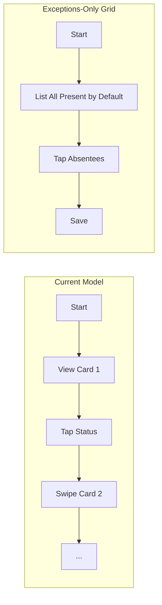

# Competitor Analysis & Strategic Product Report
## Detailed Market Analysis, Workflow Optimization, and Commercialization Strategy for `school_app`

---

## 1. Executive Summary

This report evaluates the competitive landscape of school Enterprise Resource Planning (ERP) and Learning Management System (LMS) platforms to position **School App** (`school_app`) for commercial scale. It contrasts the current Single-School implementation against leading industry competitors, including **Fedena**, **Entab (CampusCare)**, **Toddle**, **PowerSchool**, **Vidyalaya ERP**, **LEAD School**, and **ClassDojo**.

Although `school_app` provides a strong foundation for fundamental operations (like attendance, timetabling, leave management, and basic homework tracking), it remains a non-monetized, single-instance utility. To scale into a viable multi-tenant SaaS business, we must address critical gaps in **onboarding efficiency**, **core daily workflows**, **monetization mechanisms**, and **database architecture**.

### Key Recommendations
1. **Bulk Ingestion & Self-Registration Onboarding:** Shift from manual one-by-one entries to bulk Excel/CSV ingestion and registration code-based parent binding to accelerate time-to-value.
2. **Exceptions-Based Attendance:** Convert the high-friction student-by-student swiping workflow to an exceptions-only grid list to reduce teacher burnout.
3. **Automated Notification Triggers:** Move from manual sharing via WhatsApp intents to automated Firebase Cloud Messaging (FCM) and SMS gateways.
4. **Convenience-Fee Ledgers:** Integrate payment gateways to collect transaction convenience fees, generating high-frequency transactional revenue.
5. **Multi-Tenancy Re-architecture:** Decouple hardcoded single-school schema structures to support multiple separate school tenants securely.

---

## 2. Competitor Landscape Matrix

The educational technology market is split into four distinct segments:
1. **Regional Administrative ERPs:** Focus heavily on regional compliance, localized financial accounting, and high-touch setups.
2. **Integrated Curriculum Systems (Education-as-a-Service):** Offer an end-to-end curriculum, hardware, teacher training, and software bundle.
3. **Pedagogy-First LMS Platforms:** Focus on classroom collaboration, portfolio building, and interactive learning.
4. **Enterprise K-12 Student Information Systems (SIS):** Built for large districts, offering extensive system integrations and analytics dashboards.

### Market Comparison Table

| Competitor | Primary Segment | Target Audience | Onboarding Model | Monetization Model | Core Technical Strength |
| :--- | :--- | :--- | :--- | :--- | :--- |
| **Fedena** | Regional Administrative ERP | Mid-Market & Multi-Branch Chains | **Hybrid:** Guided setup wizard for configurations, backed by manual imports. | **SaaS Subscription:** Module-based licensing fees + annual maintenance agreements. | Extremely modular architecture with a plugin-based system. |
| **Entab (CampusCare)** | Regional Administrative ERP | Premium Private Schools (CBSE/ICSE) | **High-Touch:** Manual setup and database migrations handled by dedicated engineers (2–12 weeks). | **Enterprise Contracts:** Per-student-per-year licensing fee + high upfront setup costs. | Comprehensive compliance with local boards (e.g., NEP 2020 Holistic Progress Cards). |
| **Vidyalaya ERP** | Regional Administrative ERP | Budget Private & Tier-2/3 Schools | **Rapid Support:** Customer service calls with bulk template uploads. | **Low-Cost License:** Flat annual subscription starting at ₹7,500/year (high volume, low margins). | Optimized performance on low-bandwidth networks and high offline capability. |
| **LEAD School** | Integrated Curriculum (EaaS) | Mid-Market Private Schools in Tier-2/3/4 | **Consultant-Driven:** Intensive deployment with physical training consultants and hardware delivery. | **Revenue Share:** Takes a percentage (8%–12%) of the total tuition fee collected by the school. | End-to-end consolidation of curriculum, hardware, teacher aids, and ERP. |
| **Toddle** | Pedagogy-First LMS | International Schools (IB / Cambridge) | **Self-Serve to Guided:** Comprehensive video libraries, documentation, and template files. | **Premium SaaS Tiers:** Per-student-per-year fee based on selected features. | AI-assisted lesson planning, student digital portfolios, and interactive unit tracking. |
| **PowerSchool** | Enterprise SIS | Large School Districts & State K-12 Systems | **Enterprise Deployment:** Managed professional services teams handling data mapping and testing. | **Annual Enterprise SaaS:** Dynamic licensing scaled to district sizes. | High-performance reporting, integrations with third-party software, and analytics dashboards. |
| **ClassDojo** | Pedagogy-First LMS | Primary/Elementary Schools | **Fully Self-Serve:** Teachers create classes in minutes and invite parents via link/code. | **Freemium + Consumer B2C:** Free for schools; monetization via parent app subscriptions ("Dojo Beyond School"). | Highly engaging, gamified interface with immediate parent-teacher messaging. |

---

## 3. Product Gap Analysis vs. `school_app`

### 3.1 Onboarding Gaps

Onboarding determines customer churn. If the setup process is too high-friction, administrators will abandon the platform before completing implementation.

```mermaid
graph TD
    subgraph Current (school_app)
        A[Create Allowed User] -->|Manually Type Phone| B[Add Student Details]
        B -->|Repeat for Each Student| C[Manually Add Timetable]
        C --> D[System Configured]
    end
    subgraph Competitor Best Practice
        E[Admin Uploads CSV/Excel] -->|One-click Import| F[System Autogenerates Student Tokens]
        F -->|Distribute Tokens to Parents| G[Parents Download App & Self-Register]
        G --> H[System Configured]
    end
    style A fill:#ffcccc,stroke:#ff3333
    style E fill:#ccffcc,stroke:#33cc33
```

1. **Manual User Ingestion:**
   * *Gap:* In `school_app`, administrators must manually add every record and link them. In [admin_screen.dart](file:///Users/upendrapandey/school_app/lib/screens/admin_screen.dart), coordinators must type emails and phone numbers one by one to configure the `allowed_users` collection.
   * *Competitor Benchmark:* Platforms like Vidyalaya and Fedena utilize bulk Excel/CSV parsers. Administrators upload a single sheet containing classes, students, and parent phone numbers to populate the database in seconds.
2. **Parent-Student Linking Overhead:**
   * *Gap:* Coordinators must manually pair guardians with their respective children during configuration.
   * *Competitor Benchmark:* ClassDojo and Toddle generate unique 6-character alphanumeric **Student Activation Tokens** (e.g., `A8F9K2`). Parents download the app, enter the token, and the system automatically creates the parent-student mapping, offloading administrative data-entry to the users.
3. **Onboarding State Resiliency:**
   * *Gap:* Although [SchoolOnboardingScreen](file:///Users/upendrapandey/school_app/lib/features/onboarding/school_onboarding_screen.dart) saves a draft in Firestore, if the network drops or the admin exits, there is no offline-first caching for large assets (like school logos).
   * *Competitor Benchmark:* Onboarding wizards use robust local state management (like local SQLite or Hive databases) to ensure zero progress loss during long administrative setup processes.

---

### 3.2 Core Daily Workflow Gaps

Daily workflows must be highly optimized to ensure active, long-term adoption by teachers.

#### 1. Attendance Marking Model
* **Current Friction:** The [attendance_screen.dart](file:///Users/upendrapandey/school_app/lib/screens/attendance_screen.dart) displays students in a card swiper interface (`PageView`). For a class of 45 students, a teacher must perform 45 swipes and multiple taps. This results in significant daily interaction overhead.
* **Competitor Benchmark:** Modern ERPs show a scrollable list of students. By default, **all students are marked Present**. The teacher only taps on the exceptions (absent or late). This decreases the interaction complexity from $O(N)$ (where $N$ is class size) to $O(E)$ (where $E$ is the number of absentees, usually 2–4 per day).



#### 2. Leave and Attendance Integration
* **Current Friction:** Approved leave applications in [leave_requests_screen.dart](file:///Users/upendrapandey/school_app/lib/screens/leave_requests_screen.dart) do not sync with the attendance registry. If a student is on approved leave, the teacher must still manually toggle their state on the class attendance screen.
* **Competitor Benchmark:** Approving a student or teacher leave automatically writes a placeholder entry in the attendance ledger for those dates, preventing duplication of effort.

#### 3. Absence Follow-up Communication
* **Current Friction:** The [daily_calls_screen.dart](file:///Users/upendrapandey/school_app/lib/screens/daily_calls_screen.dart) lists absent students for calling, but there is no mechanism to log outcomes (e.g., "Sick", "No Answer"). Teachers must manually copy and paste phone numbers.
* **Competitor Benchmark:** When returning from a call, the app displays a modal requesting the outcome. This logs parent feedback and updates the student's daily report history.

---

### 3.3 Missing Premium Features

To charge premium subscription tiers, `school_app` must bridge several key functional gaps.

1. **Multi-Tenant Architecture:**
   * *Gap:* Multiple files in `school_app` write records directly to single-school collections. For example, [GalleryService](file:///Users/upendrapandey/school_app/lib/services/gallery_service.dart) contains hardcoded references to `school_1` structures.
   * *Competitor Benchmark:* Professional ERPs are multi-tenant out of the box, wrapping all collections under `schools/{schoolId}/...` or routing dynamically based on authenticated tenant domains.
2. **Automated Notification Gateways:**
   * *Gap:* The current [NotificationService](file:///Users/upendrapandey/school_app/lib/services/notification_service.dart) relies on client-side polling of a Firestore collection. If parents do not have the app open, they miss announcements.
   * *Competitor Benchmark:* Entab and Fedena use Firebase Cloud Messaging (FCM) to trigger mobile push alerts. They also integrate transactional SMS gateways (like Twilio, MSG91) as fallbacks for parents without smartphone internet access.
3. **Automated Payments and Ledger Sync:**
   * *Gap:* The [FeeService](file:///Users/upendrapandey/school_app/lib/services/fee_service.dart) only supports manual receipt entry (logging cash or cheques).
   * *Competitor Benchmark:* Direct integration with payment gateways (Razorpay, Stripe) allowing parents to pay fees inside the app, with automatic receipt generation and instant ledger synchronization.
4. **GPS Transport Fleet Tracking:**
   * *Gap:* Guardians have no visibility into school bus operations.
   * *Competitor Benchmark:* Integration of cheap OBD GPS trackers or a secondary "Driver App" to display live school bus locations on parent maps.

---

## 4. Monetization Strategy Comparison

We compare three primary monetization models suitable for `school_app`, detailing their financial potential and adoption friction.

### Monetization Model Matrix

| Model | Target Customer | Mechanism | Pros | Cons | Financial Potential |
| :--- | :--- | :--- | :--- | :--- | :--- |
| **Institutional SaaS Tiers** (B2B) | School Administrations | Tiered licensing fees billed monthly or annually per student. | Highly predictable, stable recurring revenue (ARR). | Longer enterprise sales cycles; budget-constrained buyers. | **High** (e.g., ₹20-₹50 / student / month) |
| **Convenience Fee Splits** (B2B2C) | Parents & Schools | Charging a small convenience fee (e.g., 0.75%) on digital fee payments. | Low sales friction; school pays nothing; aligns costs with collections. | Highly seasonal revenue, concentrated in term starts. | **Very High** (Percentage of tuition fees) |
| **D2C Parent Premium Add-ons** (B2C) | Parent Community | Charging parents for optional add-ons (GPS tracking, detailed PDF report styling). | Bypasses school budget limitations; unlocks direct consumer monetization. | High churn; relies on parental willingness to pay for premium tools. | **Medium** (Steady micro-transactions) |

### Proposed `school_app` SaaS Tier Packaging

```
[BASIC TIER]        ₹15 / student / month
  └── Core Attendance (Exceptions Grid), Homework, Announcement boards.
  
[PRO TIER]          ₹35 / student / month
  └── Basic Tier + Exam Marks, Manual Fee Log, Coordinator Substitution Matcher.
  
[ENTERPRISE TIER]   ₹60 / student / month
  └── Pro Tier + Multi-School Dashboards, Owner Expense Ledger, White-Labeled App, Priority CSV Migrations.
```

---

## 5. Feature Prioritization by Business Impact

We prioritize these gaps using a **Value-Effort Matrix** to identify quick wins versus long-term strategic projects. We rank them by Business Impact (customer retention, conversion rates, and revenue margins) and Development Effort (**S**: Days, **M**: Weeks, **L**: Months).

### Opportunity Prioritization Matrix

```
   HIGH  |----------------------------------------------------|
         | [Quick Wins]                                       | [Strategic Initiatives]
         | 1. Bulk CSV Student Import (Effort: S)             | 5. Payment Gateway Integration (Effort: M)
         | 2. Exceptions-Only Attendance List (Effort: S)     | 6. Multi-School Tenancy (Effort: L)
         | 3. Auto-Save Setup Progress (Effort: S)            | 7. Owner Expense Tracking (Effort: M)
   I     | 4. Automated Absence FCM Alerts (Effort: S)        |
   M     |                                                    |
   P     |----------------------------------------------------|
   A     | [Fill-ins]                                         | [Review/Defer]
   C     | 8. Call Feedback Notes (Effort: S)                 | 10. Live GPS Bus Tracking (Effort: L)
   T     | 9. WhatsApp Share for Reports (Effort: S)          | 11. Full LMS / Quizzes (Effort: L)
         |                                                    |
   LOW   |----------------------------------------------------|
         ------------------------------------------------------
                                LOW  <--- EFFORT --->  HIGH
```

### Prioritization Ledger

| Rank | Feature | Targeted Module | Effort | Impact | Business Rationale |
| :---: | :--- | :--- | :---: | :---: | :--- |
| **1** | **Bulk CSV Student/Teacher Upload** | Onboarding Setup | **S** (Low) | **High** | Eliminates tedious profile entry. Reduces coordinator setup drop-offs. |
| **2** | **Exceptions-Only Attendance List** | Attendance Tracker | **S** (Low) | **High** | Reduces teacher daily clicks. Encourages daily active usage (DAU). |
| **3** | **Wizard Progress Caching** | Onboarding Setup | **S** (Low) | **High** | Prevents data loss during multi-step setup. |
| **4** | **Automated Absence FCM Alerts** | Communication | **S** (Low) | **High** | Sends instant push updates to parents, increasing parent engagement. |
| **5** | **Payment Gateway Integration** | Fee Management | **M** (Med) | **Critical** | Enables transactional convenience fee monetization and automated receipting. |
| **6** | **Multi-School Tenancy Support** | System Architecture | **L** (High) | **Critical** | Re-architects paths like [GalleryService](file:///Users/upendrapandey/school_app/lib/services/gallery_service.dart) to scale to multi-tenant structures. |
| **7** | **Expense Ledger & Owner Dashboard** | Financial Controls | **M** (Med) | **High** | Introduces school profit/loss logs, making the app sticky for school owners. |
| **8** | **Call Feedback Logging** | Daily Call Tracker | **S** (Low) | **Medium** | Captures parent responses for absent students within [daily_calls_screen.dart](file:///Users/upendrapandey/school_app/lib/screens/daily_calls_screen.dart). |
| **9** | **WhatsApp Share for Report Cards** | Academic Reports | **S** (Low) | **Medium** | Enables sharing reports via WhatsApp, which is highly used in emerging markets. |
| **10** | **GPS Transport Fleet Tracking** | Fleet Operations | **L** (High) | **High** | High-value parent feature, but requires physical hardware integrations. |
| **11** | **MCQ Online Quiz Engine** | Learning Management | **L** (High) | **Low** | Expensive to maintain; highly saturated competitive market. |

---

## 6. Phase-by-Phase Execution Roadmap

```mermaid
gantt
    title school_app Strategic Roadmap
    dateFormat  YYYY-MM-DD
    section Phase 1: Onboarding & Core UX
    CSV Bulk Student Uploads      :active, p1_1, 2026-06-18, 7d
    Exceptions-Only Attendance   :active, p1_2, 2026-06-25, 5d
    Onboarding Setup Cache        :p1_3, after p1_1, 4d
    section Phase 2: Engagement & Operations
    Automated FCM Absence Alerts  :p2_1, 2026-07-10, 10d
    Call Notes Logs               :p2_2, after p2_1, 5d
    WhatsApp Report Exports       :p2_3, after p2_2, 4d
    section Phase 3: Monetization & SaaS Scaling
    Multi-School Tenancy Layer    :p3_1, 2026-08-01, 20d
    Payment Gateway Integration   :p3_2, after p3_1, 12d
    Expense Ledger & P&L Reports  :p3_3, after p3_2, 8d
```

### Phase 1: Onboarding & Core UX (Weeks 1–3)
*   **Objective:** Maximize admin activation rate and teacher retention.
*   **Deliverables:**
    1. Implement a CSV upload parser on the student list page to populate Firestore in batches.
    2. Convert [attendance_screen.dart](file:///Users/upendrapandey/school_app/lib/screens/attendance_screen.dart) into a scrollable list view with present states enabled by default.
    3. Persist [SchoolOnboardingScreen](file:///Users/upendrapandey/school_app/lib/features/onboarding/school_onboarding_screen.dart) state locally to ensure resume-on-disconnect behavior.

### Phase 2: Engagement & Operations (Weeks 4–7)
*   **Objective:** Drive parent daily active usage and automate parent communication.
*   **Deliverables:**
    1. Configure server-side Firebase Cloud Function triggers on attendance writes to dispatch push notifications and SMS alerts.
    2. Add call log inputs to [daily_calls_screen.dart](file:///Users/upendrapandey/school_app/lib/screens/daily_calls_screen.dart) to track outcome history.
    3. Enable direct sharing of report cards and payment receipts to WhatsApp.

### Phase 3: Monetization & SaaS Scaling (Weeks 8–12)
*   **Objective:** Launch revenue generation channels and scale platform multi-tenancy.
*   **Deliverables:**
    1. Refactor Firestore paths to dynamically load under `schools/{schoolId}`.
    2. Integrate Razorpay / Paytm SDKs within [fee_collection_screen.dart](file:///Users/upendrapandey/school_app/lib/screens/fee_collection_screen.dart) and automate digital reconciliation.
    3. Release the Expense Tracker & Owner dashboard modules to unlock the **Enterprise Tier** subscription tier.
