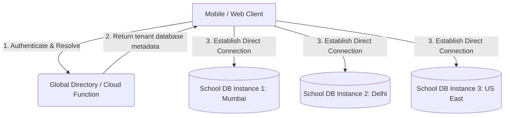

# CTO Technical Assessment: Scaling to 1 Million Users

This report presents a technical roadmap and strategic review of the school attendance application (`school_app`) from the perspective of the Chief Technology Officer (CTO). Our objective is to ensure that the platform can scale to **1 million active users** (across thousands of schools) with high availability, top-tier security, premium user experience, and monetization readiness.

---

## Executive Summary

While the current codebase incorporates excellent local cache handling, offline support, and server-side functions, it is fundamentally designed as a **single shared Firebase database instance (pseudo-multi-tenancy)**. To serve 1 million users, we must transition to a **federated multi-tenant architecture with dynamic regional sharding**.

---

## Comprehensive Systems Review

### 1. Security & Isolation
- **Password Hardening**: Plaintext password storage has been successfully purged from `allowed_users` records and migrated to secure Firebase Auth.
- **Tenant Scope Enforcement**: `firestore.rules` and `storage.rules` have been hardened to restrict operations to the caller's verified `schoolId` (using Firebase Auth custom claims synced from `allowed_users/{email}`).
- **Root Admin Risk**: System root-admin functions are still gated on hardcoded emails (`mandvishal@gmail.com` and `admin@schoolapp.org`) inside Firestore rules and client logic. A compromise of either email yields administrative control over all tenants.
- **Audit Trails**: Client-side audit log writes are disabled (`allow create: if false;` in `firestore.rules`), forcing all audit entries through the secure `writeAudit` Cloud Function, which verifies identity token custom claims.

### 2. Scalability & Database Performance
- **Aggregate collections**: Fee summaries and attendance dashboards have been optimized to read from pre-aggregated collections (`class_fee_summaries` and `attendance_summary`), reducing read complexity from $\mathcal{O}(N)$ to $\mathcal{O}(\text{classes})$.
- **Unbounded Collections**: The `notifications` and `audit_logs` collections grow indefinitely. Data retention is now handled via the `expireAt` timestamp and Firestore TTL policies (90 days for notifications, 365 days for audit logs).
- **Collection Group Queries**: Principal EOD digest screens utilize collection-group queries on subcollections (e.g., `remarks`, `payments`) with a mandatory `schoolId` filter. However, as the database scales to millions of documents, this will experience index-limit constraints.

### 3. Performance & UX
- **Blocking Startup Tasks**: In `lib/main.dart`, the push notification permission request (`await messaging.requestPermission(...)`) blocks execution before the first UI frame is drawn, causing a native splash screen freeze on first launch.
- **In-Memory Caches**: `TimetableService._settingsCache` now incorporates a 5-minute Time-To-Live (TTL) to balance network round-trip overhead with multi-device updates.
- **i18n Coverage**: Hindi localization is fully supported on core entry and login screens, but administrative dashboards and report-card sheets are still hardcoded in English.

### 4. Monetization Readiness
- **Feature Gating**: The client-side `PremiumFeatureGate` restricts features (e.g. advanced analytics, custom branding) based on `subscriptionPlan`.
- **Payment Operations**: The school licensing plan is statically configured in the database. There is no automated billing integration, invoice generation, or self-service payment gateway (e.g., Stripe, Razorpay) for school owners.

---

## Single Highest-Impact Improvement: Global Tenant Directory & Database Sharding

### Problem
The current application architecture forces all schools to write to a single Firestore database instance (`attendanceapp-e76e1`). Under this design:
1. **Firestore Throughput Limits**: Firestore imposes a hard limit of **10,000 writes per second** per database instance. A single school with 1,000 students marking attendance, taking exams, and collecting fees generates significant write traffic. Scaling to 1,000+ schools (1M+ users) will exceed this ceiling during morning peak hours (8:00 AM – 9:30 AM), resulting in transaction failures and database lockout.
2. **Egress Costs & Latency**: The Firebase project is co-located in `asia-south1` (Mumbai). A school operating in another region (e.g. US or Europe) experiences severe network latency.
3. **Regulatory Compliance (DPDP & GDPR)**: Storing sensitive student personal data (PII) from multiple different institutions in the same logical collection without database-level segregation violates corporate security policies and data protection regulations (such as the Indian DPDP Act 2023).

### Impact
- **System Outages**: Concurrent morning attendance sweeps will result in transaction rollbacks, write contention, and application lockouts.
- **Compliance Failure**: Inability to isolate and delete a single school's database partition upon contract termination.
- **Business Risk**: A single regional outage in Mumbai takes down global operations.

### Proposed Solution: Federated Tenant Architecture
We propose replacing the single-database model with a **Federated Tenant Architecture** governed by a **Global Directory Router**:



1. **Global Tenant Lookup Database**: Establish a low-latency, globally replicated lookup collection (or a light Cloud Function) that maps a user's authenticated email to their specific `schoolId` and target `Firebase Project URI` (database partition).
2. **Dynamic Firestore Initialization**: Refactor the Flutter codebase to initialize the Firestore instance dynamically based on the project configuration returned during authentication. Instead of compiling with a hardcoded `google-services.json`, the app will configure Firebase options at runtime:
   ```dart
   // Conceptual Dynamic Initialization
   await Firebase.initializeApp(
     name: "school_${resolvedSchoolId}",
     options: FirebaseOptions(
       apiKey: resolvedMetadata.apiKey,
       appId: resolvedMetadata.appId,
       messagingSenderId: resolvedMetadata.messagingSenderId,
       projectId: resolvedMetadata.projectId,
     ),
   );
   ```
3. **Automated Provisioning Script**: Deploy a backend pipeline that spins up a new Firestore instance or sub-partition (using Firebase Multi-Db features or separate GCP projects) automatically when a school completes the 6-step onboarding wizard.

### Estimated Effort
* **Architecture Design & API Routing**: 1.5 weeks
* **Dynamic Client-Side Firebase Initialization Refactoring**: 2 weeks
* **Migration Scripting & Validation**: 1.5 weeks
* **Total Estimated Effort**: **5 Weeks (2 Developers)**

### Estimated Business Value
- **Infinite Scale**: Scale-out horizontally. Zero risk of database-wide lockouts or write limits.
- **Enterprise Readiness**: Compliance with enterprise-grade SLA agreements and regional data protection regulations (DPDP Act, GDPR).
- **Reduced Blame Window**: A database corruption or transaction lockup in one school does not affect other paying schools.
- **Regional Latency Optimization**: Automatically spin up instances in the GCP region nearest to the school's physical location.
