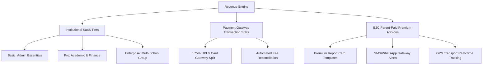

# School App (school_app) Revenue & Commercialization Report
**Author:** CEO, School App  
**Date:** June 13, 2026  
**Status:** Strategic Proposal  

---

## 1. Executive Summary

As the CEO of **School App** (`school_app`), I have completed a thorough operational and codebase audit of our product. Our application has a solid functional core: it digitizes daily attendance, bell timetables, coordinator substitution matching, copy-checking, and offline-queued database writes. 

However, we are currently positioned as a **single-school, non-monetized utility**. To unlock venture-scale growth, we must transform this product into a **Multi-Tenant Software-as-a-Service (SaaS)** and transaction-enabled platform. 

This report outlines our strategic commercialization framework, targeting:
1. **Core SaaS Tiers** for institutional management.
2. **Transactional Convenience Fees** via automated payment rails.
3. **B2C Parent-Paid Premium Add-ons** shifting the financial burden from budget-constrained schools.
4. **Retention-Driving Operations** that prevent churn.

We rank these opportunities using our core decision matrix: **Revenue Potential vs. Development Effort vs. Competitive Advantage**.

---

## 2. Product Monetization Pillars

We will monetize the platform through three primary channels, balancing enterprise stability with high-volume transactional margins.



### Pillar 1: Institutional SaaS Tiers (B2B)
We will charge schools an annual or monthly subscription fee calculated **per active student**. This aligns pricing with school size and ensures high scalability.

*   **Basic Tier (Administrative Essentials):**
    *   *Core Features:* Exceptions-only Attendance marking, Bell schedules, Homework posting, and Class noticeboards.
    *   *Target Market:* Budget private schools in Tier-2/3 regions.
*   **Pro Tier (Academic & Financial Performance):**
    *   *Core Features:* Basic SaaS package + Exam Marks Entry, manual Fee Receipting, Leave Approvals, and the Coordinator's Timetable Substitution Matcher.
    *   *Target Market:* Established mid-market schools seeking to replace paper processes.
*   **Enterprise Tier (The Connected Chain):**
    *   *Core Features:* Pro SaaS package + Multi-School Aggregated Dashboard (for school networks), Owner Expense Logging (Profit & Loss), Custom Subdomain (white-labeling), and dedicated CSV data migration pipelines.
    *   *Target Market:* Premium school groups and corporate chains (e.g., DPS, DAV networks).

### Pillar 2: Payment Gateway Transaction Splits (B2B2C)
Currently, [fee_collection_screen.dart](file:///Users/upendrapandey/school_app/lib/screens/fee_collection_screen.dart) and [fee_service.dart](file:///Users/upendrapandey/school_app/lib/services/fee_service.dart) record manual cash, UPI QR, and cheque logs. By integrating a native payment gateway (e.g., Razorpay, Paytm, or Stripe SDK):
*   Parents pay tuition online directly through their app.
*   The platform charges a **0.5% to 1.25% convenience fee** on each transaction.
*   The system automatically triggers database writes to update `fee_payments` and prints a secure PDF receipt for the guardian.
*   *Monetization Impact:* High-frequency, recurring transactional revenue, particularly during term starts (April, July, October, January).

### Pillar 3: B2C Parent-Paid Premium Add-ons (Direct-to-Consumer)
To lower barriers to entry for cash-strapped schools, we can offer the core administration platform to the school at cost (or free) and charge parents micro-transactions for high-value convenience features:
*   **Premium Visual Assets:** Custom-styled report card PDFs (designed via our `pdf` and `printing` engine) and academic performance trends.
*   **SMS/WhatsApp Gateway Upgrades:** Automated SMS alerts for student absences and emergency weather days (vital for parents without reliable data connections).
*   **GPS Transport Integration:** Access to live school bus maps and ETA notifications (using device coordinates).

---

## 3. High-Value Monetizable Features & Add-on Services

Below are the key features schools and parents will pay a premium for, mapping existing code systems to their commercial counterpart.

### 1. Automated SMS / WhatsApp Gateway Packages
*   **Existing Technical Debt:** [NotificationService](file:///Users/upendrapandey/school_app/lib/services/notification_service.dart) relies on client-side polling of a `notifications` collection. There is no server-side push (FCM) or SMS fallback. Teachers must manually launch WhatsApp to alert parents of absentees.
*   **Premium Opportunity:** Introduce a Cloud Function trigger on attendance writes that dispatches transactional SMS alerts when a child is marked absent.
*   **Revenue Model:** Schools buy SMS credit packages (e.g., ₹5,000 for 10,000 credits). We buy bulk credits at ₹0.12/SMS and resell at ₹0.30/SMS, realizing a **60% gross margin**.

### 2. Expense Tracker & Owner P&L Dashboard
*   **Existing Technical Debt:** We track the intake side via `fee_payments` and class structures, but the app has no ledger for school operating costs.
*   **Premium Opportunity:** Create a comprehensive business ledger module. Owners/Principals can record salaries, utility bills, inventory purchases, and lease payments.
*   **Revenue Model:** Bundled exclusively in the **Enterprise SaaS Tier** (B2B). It elevates the app from a classroom tool to a full financial operating system.

### 3. Custom White-Labeling & Dedicated App Publishing
*   **Existing Technical Debt:** The app branding is hardcoded with a violet color scheme. Multiple services are hardcoded for `school_1` (e.g., [GalleryService](file:///Users/upendrapandey/school_app/lib/services/gallery_service.dart)).
*   **Premium Opportunity:** Migrate to full multi-tenancy and build a white-labeled build pipeline where a school can publish a branded app to the Google Play Store and Apple App Store (e.g., "Greenwood International App").
*   **Revenue Model:** Charged as a premium setup add-on: **₹25,000–₹50,000 setup fee** + **₹10,000/year maintenance contract** (covering developer account fees and updates).

### 4. Smart Card / RFID Biometric Gate Integrations
*   **Existing Technical Debt:** Attendance marking requires teachers to swipe through students on their phones daily.
*   **Premium Opportunity:** Partner with local hardware vendors to supply RFID reader gates or biometric machines. On swipe, the reader hits a secure web-hook endpoint that updates the Firestore `attendance/{className_YYYY-M-D}` collection.
*   **Revenue Model:** **Hardware Markup (20–30%)** + **Integration License Fee** of ₹15,000/year per school.

### 5. Premium Document Vault & Digital Locker
*   **Existing Technical Debt:** Currently, no document storage is supported for student profiles outside of basic photo uploads in [GalleryService](file:///Users/upendrapandey/school_app/lib/services/gallery_service.dart).
*   **Premium Opportunity:** Implement a secure PDF document vault (storing birth certificates, medical records, and ID proofs) in Firebase Storage.
*   **Revenue Model:** Charge parents a small annual storage fee (₹150/year) or bundle it into the Pro/Enterprise school tier.

---

## 4. Operational Retention & "Sticky" Features

Retention features create high switching costs, making it nearly impossible for a school to transition off our platform.

```
   [Timetable & Substitution History]  ──► Automated, fair replacement suggestions
                                          (High day-to-day administrative reliance)
                                          
   [Copy-Checking Roster]              ──► Cumulative records of student homework compliance
                                          (Hard to replicate or migrate manually)
                                          
   [Historical Academic Archive]       ──► Year-over-year transcript history
                                          (Leaving means losing multi-year records)
```

1.  **Timetable Substitution Matching & Leave History:**
    *   *Why it's sticky:* In [free_bells_screen.dart](file:///Users/upendrapandey/school_app/lib/screens/free_bells_screen.dart), when a teacher is approved for leave, the system logs the history and automatically suggests substitute teachers based on period counts. This saves coordinators hours of morning chaos. Once a school depends on this algorithm, they cannot return to manual spreadsheets.
2.  **Granular Copy-Checking Records:**
    *   *Why it's sticky:* In [copy_checking_screen.dart](file:///Users/upendrapandey/school_app/lib/screens/copy_checking_screen.dart), teachers track whether copies are `checked`, `incomplete`, or `not_done`. Over a semester, this provides a highly detailed ledger of student accountability. This data represents proprietary, parent-facing educational value that competitors do not capture at this depth.
3.  **Multi-Year Academic Portfolios:**
    *   *Why it's sticky:* By introducing a "session" field to our models (e.g., `2026-2027`), we archive report cards, fee records, and attendance histories. A school that has accumulated three years of historical academic records for 1,000 students faces a massive data migration barrier if they try to switch vendors.

---

## 5. Opportunity Prioritization Matrix

To prioritize development, we analyze each commercial opportunity below. Opportunities are ranked based on their **Revenue Potential**, **Development Effort**, and **Competitive Advantage**.

### Prioritization Rankings

| Rank | Opportunity | Target Audience | Revenue Potential | Dev Effort | Competitive Advantage | Rationale |
| :---: | :--- | :--- | :--- | :--- | :--- | :--- |
| **1** | **Payment Gateway Integration & Auto-Receipts** | Guardians & Coordinators | **High** (Convenience fee share + transaction volume) | **Medium** (Razorpay/Stripe SDK integration) | **Medium** (Standard but expected; eases fee collection friction) | Resolves the massive friction in [fee_collection_screen.dart](file:///Users/upendrapandey/school_app/lib/screens/fee_collection_screen.dart) and locks in transactional revenue. |
| **2** | **Automated SMS / WhatsApp Gateway Alerts** | School Admin & Guardians | **High** (High transactional volume + 60% margins) | **Low** (Cloud Function triggering SMS API) | **Medium** (High utility; parents demand real-time alerts) | Extremely low development footprint; provides immediate, high-margin transactional income. |
| **3** | **School Expense Tracker & P&L** | School Owners | **Medium** (Drives upsells to Enterprise tier) | **Medium** (CRUD screens + PDF P&L export) | **High** (Most competitors focus purely on admin, not school P&L) | Turns the app into a vital dashboard for school owners, increasing Enterprise retention. |
| **4** | **Custom App Store Publishing (White-Labeling)** | Premium Institutions | **High** (One-time setup fee + recurring maintenance) | **High** (CI/CD pipeline automation for builds) | **High** (Highly valued by school marketing boards) | Generates large upfront cash injections and establishes long-term customer lock-in. |
| **5** | **B2C Premium Parent Features (Report PDFs & Analytics)** | Guardians | **Medium** (Direct-to-consumer micro-payments) | **Low** (Reuses existing PDF structures) | **Low** (Relies on parental willingness to pay) | Lowers the subscription cost barrier for budget schools by shifting the cost to parents. |
| **6** | **Smart Card / RFID Hardware Integration** | Medium/Large Schools | **Medium** (Hardware markup + annual licensing) | **High** (Hardware Webhook endpoints + Sync queue) | **High** (Creates an unbeatable barrier to churn) | High hardware stickiness, but requires physical deployment partnerships. |
| **7** | **LMS MCQ Quiz & Study Vault** | Teachers & Guardians | **Low** (Minor upsell feature) | **High** (Complex interactive testing framework) | **Low** (Heavily saturated market) | High effort with minimal immediate revenue payout; best deferred. |

---

## 6. Implementation & Commercialization Roadmap

We recommend launching this commercial expansion across three strategic execution phases.

```
PHASE 1: Core Transactional & Notification Infrastructure (Weeks 1–4)
   ├── Razorpay / Stripe SDK Integration (fee payments)
   └── SMS/WhatsApp API triggers on student absences (Cloud Functions)

PHASE 2: Premium Parent Value-Add & Owner Tools (Weeks 5–8)
   ├── Interactive parent dashboard & Premium Report Card exports
   └── Expense Logging & Monthly P&L report exports (Enterprise SaaS)

PHASE 3: Enterprise Scale & Hardware Ecosystem (Weeks 9-12+)
   ├── Multi-tenant database migrations (moving beyond 'school_1')
   └── RFID / Biometric API endpoints & hardware partnership launch
```

### Phase 1: Core Transactional & Notification Infrastructure (Weeks 1–4)
*   **Goal:** Establish immediate transactional cash flow and automated communication.
*   **Actions:**
    1.  Integrate the Razorpay/Paytm SDK. Allow parents to pay dues inside the app, automatically generating receipt documents via [fee_service.dart](file:///Users/upendrapandey/school_app/lib/services/fee_service.dart).
    2.  Write a Firebase Cloud Function that triggers on a new absence record in `attendance/` to send a templated SMS to the guardian's verified phone number.
    3.  Introduce the **Basic** and **Pro** SaaS tiers, locking in existing beta schools.

### Phase 2: Premium Parent Value-Add & Owner Tools (Weeks 5–8)
*   **Goal:** Target B2C monetization channels and owner-level personas.
*   **Actions:**
    1.  Design a tab-based layout for the Guardian portal, offering premium PDF report card templates and learning progress charts (using `fl_chart`) for a small yearly parent fee (e.g., ₹250/year).
    2.  Develop the school expense ledger and P&L module, prompting Pro tier schools to upgrade to the **Enterprise Tier** to access financial reports.

### Phase 3: Enterprise Scale & Hardware Ecosystem (Weeks 9–12+)
*   **Goal:** scale to a multi-school platform and build hardware dependencies.
*   **Actions:**
    1.  Refactor Firestore paths from hardcoded `schools/school_1` structures in [gallery_service.dart](file:///Users/upendrapandey/school_app/lib/services/gallery_service.dart) to a dynamic tenant model (`schools/{schoolId}`).
    2.  Setup automated Android/iOS build scripts to support custom white-labeled App Store submissions.
    3.  Publish API documentation for physical RFID reader integrations.

---
*End of Report.*
