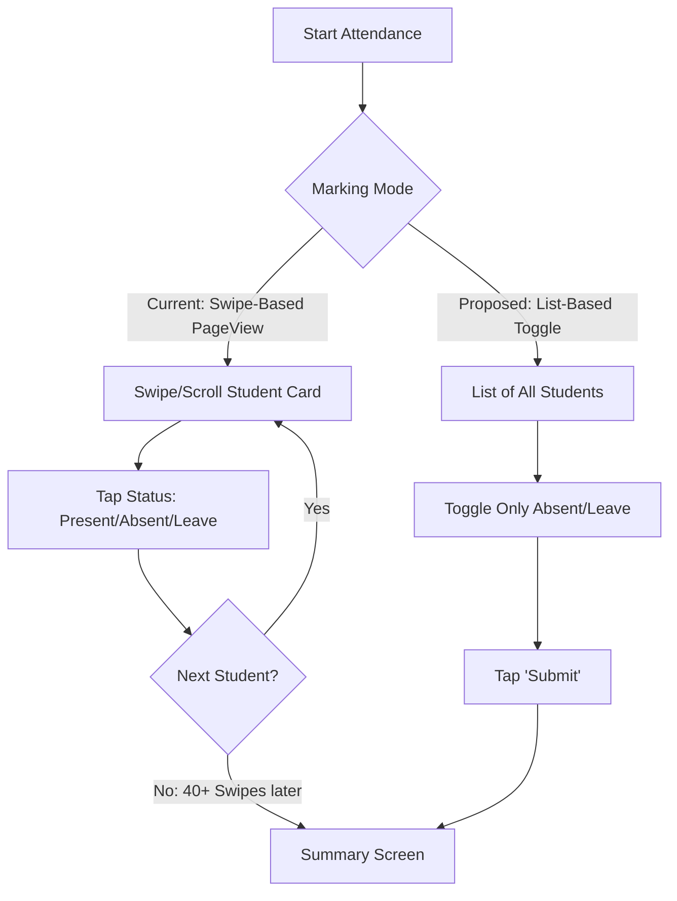

# UX Audit & Usability Report: School Attendance App

This report evaluates the school management application's user experience (UX) from the perspectives of its four primary user roles. It identifies critical usability blockers, workflow redundancies, navigation friction, and design inconsistencies across all screens, providing actionable recommendations for production readiness.

---

## 1. Executive Summary

While the application features a modern visual layout using a violet-branded theme, the user interface suffers from significant friction. Key operational tasks—such as daily attendance marking, notification dispatch, and onboarding—require an excessive number of swipes and taps. 

Critical errors fail silently due to unlogged exception blocks, and navigation is dominated by very long scrollable lists without index aids or drawer-based shortcuts.

### What is Already Fixed (Do Not Report/Change)
* **Authentication Security & Session Locks**: Role verification guards, idle timeout gates (7-day cold start), and device-email autofills have been implemented.
* **Consent Gating**: Consent verification check is successfully enforced before fanning out automated notifications or SMS.
* **Basic Locales**: Indian currency fields (`₹` and integer paise conversion) and basic authentication screen internationalization are active.

---

## 2. Role-Based UX Analysis

### 2.1 The Teacher Persona
Teachers use the app on mobile devices in fast-paced classroom environments. Efficiency and speed are critical.

* **The Attendance Swipe Bottle-Neck (Too Many Taps & Swipes)**
  * **Issue**: Daily attendance marking (`attendance_screen.dart`) uses a vertical `PageView.builder`. For a class of 40+ students, a teacher must scroll or swipe vertically 40 times, tapping each card individually. If a teacher wants to mark just 2 absentees, they still must navigate through the entire list to reach the final summary screen.
  * **Recommendation**: Replace the vertical `PageView` with a scrollable list view displaying student rows. Default all students to "Present" and allow the teacher to tap a status button (P/A/L) only for exceptions (absentees/leaves). Add a "Mark All Present" button.
* **Manual WhatsApp Dispatches (Too Many Taps)**
  * **Issue**: Sending absence notifications via WhatsApp requires the teacher to tap the share/notify button for each absent student individually. In a school with 5–10% daily absentees, this is highly repetitive.
  * **Recommendation**: Implement a batch notification queue or trigger a server-side bulk WhatsApp dispatch via an integration (e.g., Twilio API) rather than relying on manual client-side app-switching for each record.
* **Disconnected Leave & Attendance (Confusing Workflows)**
  * **Issue**: When a guardian's leave request is approved, it does not auto-populate the attendance registry. The teacher must still manually mark the student as "Leave" in the date-range attendance tool.
  * **Recommendation**: Automate this process. When a student leave request is approved, write the status to the corresponding day's `attendance` collection automatically.
* **Dual Task Inboxes (Poor Navigation)**
  * **Issue**: Teachers are assigned tasks in two separate lists: general class tasks (`tasks` collection) and coordinator/principal tasks (`staff_tasks` collection). They must check different screens to track their duties.
  * **Recommendation**: Consolidate the two views into a single "My Tasks" screen with filter tabs (e.g., "Class Tasks" vs. "Staff Duties").

---

### 2.2 The Guardian Persona
Guardians require clear, glanceable updates about their children and simple ways to perform payments or consent requests.

* **Multi-Child Navigation Lock (Confusing Workflows & Poor Navigation)**
  * **Issue**: Parents with multiple children in the school land on Child #1's dashboard by default. Switching children requires manually opening the child switcher in the header. Deep links or notification taps do not auto-switch the active child context, leading to blank screens or out-of-context data.
  * **Recommendation**: Read the target child's admission ID from the notification payload and automatically trigger `_switchChild` prior to rendering the dashboard.
* **Excessive Scroll Depth (Poor Navigation)**
  * **Issue**: The guardian dashboard is a single vertical list containing over 15 feature tiles (Timetable, Homework, Daily Diary, Study Materials, Exams, Results, Trends, Attendance History, Certificate, Leave, Fees, PTM, etc.). Important day-to-day items are pushed far below the fold.
  * **Recommendation**: Redesign the guardian portal using a modern dashboard tab bar:
    * **Tab 1: Summary** (Glanceable today status, homework due today, alerts).
    * **Tab 2: Academics** (Timetable, homework history, diary, study materials).
    * **Tab 3: Progress** (Reports, marks, performance trends).
    * **Tab 4: Admin** (Fees, consent, leave application).
* **Broken Session Resume on Roster Deletion (Confusing Workflows & Missing Feedback)**
  * **Issue**: If a student is removed from the school records, the guardian's cached local session is not cleared. On next app launch, they are routed to a broken dashboard filled with null values, permission-denied spinners, or crashes.
  * **Recommendation**: If student lookup returns empty or unauthorized, clear the guardian's SharedPreferences session and redirect them to the Login screen with an explanatory message.

---

### 2.3 The Coordinator Persona
Coordinators manage timetables, handle substitutions, oversee student settings, and verify payment claims.

* **Setup Wizard Progress Loss (Confusing Workflows)**
  * **Issue**: The 6-step school onboarding/settings wizard (`school_onboarding_screen.dart`) has no persistence for partial entries. If the coordinator closes the app at step 5, they must start again from step 1, re-typing school details, addresses, and fees.
  * **Recommendation**: Save the state of each step locally in `SharedPreferences` as it is completed, and prompt to "Resume Onboarding" on cold starts.
* **Invisible Guardian Detail Updates (Missing Feedback)**
  * **Issue**: When a guardian submits detail corrections (e.g., spelling edits, phone number updates) via their portal, the coordinator receives no notification or badge indicator. The coordinator must happen to view that specific student's profile to discover the pending change.
  * **Recommendation**: Add a "Pending Approvals" badge and screen to the Coordinator dashboard where all parent-initiated changes can be reviewed and approved in one place.
* **Lack of Lists Search/Filter (Poor Navigation)**
  * **Issue**: Roster views (student list, teacher directory, fee history) show long alphabetical or chronological listings without inline search bars or filters, forcing coordinators to scroll through hundreds of records.
  * **Recommendation**: Add standard text-based search fields and filter chips (by grade, section, or payment status) at the top of all listings.

---

### 2.4 The Principal Persona
Principals require a birds-eye view of school attendance, staff duties, and institutional finances.

* **Severe Open Latency / Read Storms (Missing Feedback & Poor Navigation)**
  * **Issue**: Opening the principal dashboard triggers multiple simultaneous query scans (absentee aggregates, teacher rosters, tasks, etc.). The dashboard displays empty placeholders or infinite spinners without status text during this lag.
  * **Recommendation**: Implement dashboard data caching. Render the last-cached summary instantly, and replace it once the active Firestore stream updates. Add a linear progress bar indicator.
* **Bypassable Deletion Workflows (Confusing Workflows)**
  * **Issue**: The app provides a strict principal approval flow for deleting teachers (`teacher_deletion_requests`). However, coordinators can bypass this and delete teachers directly via the `deleteAccount` Cloud Function.
  * **Recommendation**: Restrict the direct account deletion function to owner roles only, enforcing the deletion request flow for coordinators.

---

## 3. Core UX Violations (Categorized)

### 3.1 Confusing Workflows
1. **Disconnected Leave/Attendance Systems**: Approving student leave doesn't create the corresponding 'Leave' record in the daily attendance registry.
2. **Setup Progress Loss**: The 6-step setup wizard does not allow coordinators to save drafts, forcing them to re-enter all details if interrupted.
3. **Orphaned Sessions for Removed Students**: Deleted students leave parent accounts logged into a broken, un-synchronized dashboard.

### 3.2 Too Many Taps
1. **PageView Attendance Marking**: Marking a class of 40 students requires 40 swipes and taps. 
2. **Individual WhatsApp Sharing**: Sending absentee notices requires teachers to tap through each parent row, switching apps back-and-forth for each message.
3. **Call outcomes are double-logged**: The daily calls screen launches the phone dialer, but the teacher must remember to navigate back and manually record the call outcome.

### 3.3 Missing Feedback
1. **Silent Catches**: 27 silent `catch (_) {}` blocks swallow failures. If an attendance sync fails, the spinner stops and the app reports "Success" to the user, losing data.
2. **No Offline Indicators**: Although the app queues attendance writes offline, there is no visual indicator showing whether the app is currently connected or syncing.
3. **No Progress Indicators**: Large batch exports (e.g., report card batch generation) show no progress or completion feedback.

### 3.4 Poor Navigation
1. **Vertical Scroll Depth**: Dashboards (especially Guardian and Teacher) are massive single-page lists. Users must scroll deeply to access secondary features.
2. **No Roster Search**: No text filtering is available on the student or teacher directories, making navigation slow for large schools.
3. **No Quick Role Switcher**: Users with multiple management roles (e.g., Owner + Principal) cannot switch contexts quickly without logging out.

### 3.5 Inconsistent Design
1. **Hardcoded Color Tokens**: Over 157 raw `Color(0x...)` values are used instead of `AppTheme` variables, causing theme breaks (e.g., mismatched purples or grey text over grey backgrounds).
2. **Locale Gaps**: Although Hindi localization is fully defined, post-login screens ignore user language settings and display hardcoded English strings.
3. **Numeric Formatting**: Financial reports display unformatted decimals (e.g., `₹12345.0`) instead of locale-grouped currencies (e.g., `₹12,345.00`).

---

## 4. Actionable UX Improvement Plan

| Priority | Issue / Target Screen | Proposed Fix | Impact |
| :--- | :--- | :--- | :--- |
| **P0 (Critical)** | Attendance PageView | Replace with a standard list view. Default to 'Present', allowing teachers to mark only absent/leave exceptions. Add a bulk "Save" confirmation. | Reduces daily marking taps by **90%** |
| **P0 (Critical)** | Error Handling (All Screens) | Replace silent catch blocks with a user-facing Toast or Dialog stating "Sync failed, saved locally" or "Unable to save, please retry". | Prevents silent data loss |
| **P1 (High)** | Guardian Dashboard | Split the 15+ tile list into a tabbed layout (Home, Academics, Progress, Admin). | Enhances feature discoverability |
| **P1 (High)** | Onboarding Setup | Implement local persistence for wizard steps so coordinators do not lose progress. | Decreases setup drop-offs |
| **P2 (Medium)** | List Filtering (Rosters) | Add search bars and filter chips to student, teacher, and payment collections. | Speeds up daily administration |
| **P2 (Medium)** | Theme Consistency | Replace all 157 hardcoded color literals with `AppTheme` variables. | Ensures consistent brand aesthetics |
