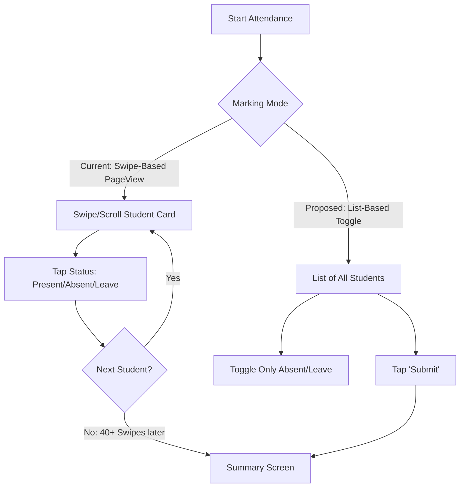

# UX Audit & Usability Report: School Attendance App

This report evaluates the school management application's user experience (UX) from the perspectives of its four primary user roles: **Teacher**, **Guardian**, **Coordinator**, and **Principal**. It identifies critical usability blockers, workflow redundancies, navigation friction, and design inconsistencies across all screens, providing actionable recommendations for production readiness.

---

## 1. Executive Summary

While the application features a modern visual layout using a teal-branded theme, the user interface suffers from significant friction. Key operational tasks—such as daily attendance marking, call tracking, and onboarding—require an excessive number of swipes and taps. 

Furthermore, critical sync errors fail silently due to unlogged/swallowed exception blocks, and navigation is dominated by very long scrollable lists without index aids, text filtering, or role-based switching.

> [!NOTE]
> ### What is Already Fixed (Do Not Report/Change)
> * **Authentication Security & Session Locks**: Role verification guards, idle timeout gates (7-day cold start), and device-email autofills have been implemented.
> * **Consent Gating**: Consent verification check is successfully enforced before fanning out automated notifications or SMS.
> * **Basic Locales**: Indian currency fields (`₹` and integer paise conversion) and basic authentication screen internationalization are active.

---

## 2. Role-Based UX Analysis

### 2.1 The Teacher Persona
Teachers use the app on mobile devices in fast-paced classroom environments. Efficiency and speed are critical.

* **The Attendance Swipe Bottleneck (Too Many Taps & Swipes)**
  * **File:** [attendance_screen.dart](file:///Users/upendrapandey/school_app/lib/features/attendance/attendance_screen.dart#L1115-L1145)
  * **Issue**: Daily attendance marking uses a vertical `PageView.builder`. For a class of 40+ students, a teacher must scroll or swipe vertically 40 times, tapping each card individually. If a teacher wants to mark just 2 absentees, they still must navigate through the entire list to reach the final summary screen.
  * **Recommendation**: Replace the vertical `PageView` with a scrollable list view displaying student rows. Default all students to "Present" and allow the teacher to tap a status button (P/A/L) only for exceptions (absentees/leaves). Add a "Mark All Present" button.
* **Intrusive Daily Call Logging (Confusing Workflows & Too Many Taps)**
  * **File:** [daily_calls_screen.dart](file:///Users/upendrapandey/school_app/lib/features/attendance/daily_calls_screen.dart#L153-L175)
  * **Issue**: Tapping the call button immediately launches the dialer and pops up the `_recordCall` notes dialog in the app *before* the call actually connects or completes. This interrupts the OS phone transition and prompts the teacher to record notes when they haven't even spoken to the guardian.
  * **Recommendation**: Trigger the call log entry dialog only when the teacher returns from the system dialer, or let them manually tap a separate "Add Notes" button on the call roster.
* **Disconnected Leave & Attendance (Confusing Workflows)**
  * **File:** [leave_requests_screen.dart](file:///Users/upendrapandey/school_app/lib/features/leave/leave_requests_screen.dart)
  * **Issue**: When a coordinator approves a student's leave request, it does not auto-populate the attendance registry. The teacher must still manually mark the student as "Leave" in the attendance tool.
  * **Recommendation**: When a student leave request is marked as "Approved", trigger a database transaction to update the status in the corresponding day's `attendance` collection automatically.
* **Dual Task Lists (Poor Navigation)**
  * **File:** [home_screen.dart](file:///Users/upendrapandey/school_app/lib/features/dashboards/home_screen.dart)
  * **Issue**: Teachers are assigned tasks in two separate lists: general class tasks (`tasks` collection) and coordinator/principal tasks (`staff_tasks` collection). They must navigate to different screens to check their duties.
  * **Recommendation**: Consolidate the two views into a single "My Tasks" screen with filter tabs (e.g., "Class Tasks" vs. "Staff Duties").

---

### 2.2 The Guardian Persona
Guardians require clear, glanceable updates about their children and simple ways to perform payments or consent requests.

* **Non-Functional Child Switcher (Poor Navigation & Confusing Workflows)**
  * **File:** [guardian_dashboard.dart](file:///Users/upendrapandey/school_app/lib/features/dashboards/guardian_dashboard.dart#L1281-L1283)
  * **Issue**: The child switcher helper method `_childSwitcher()` returns `const SizedBox.shrink();`. For parents with multiple children, there is no way to switch children from the main header. The profile switcher dialog is also hidden and clunky.
  * **Recommendation**: Replace the `SizedBox.shrink()` in `_childSwitcher` with a row of sibling avatars or a dropdown list at the top header to let parents switch student contexts instantly.
* **Excessive Scroll Depth (Poor Navigation)**
  * **File:** [guardian_dashboard.dart](file:///Users/upendrapandey/school_app/lib/features/dashboards/guardian_dashboard.dart#L472-L700)
  * **Issue**: The guardian dashboard is a massive vertical list containing over 15 feature tiles (Timetable, Homework, Daily Diary, Study Materials, Exams, Results, Trends, Attendance History, Certificate, Leave, Fees, etc.). Important day-to-day items are pushed far below the fold.
  * **Recommendation**: Redesign the guardian portal using a modern dashboard tab bar:
    * **Tab 1: Summary** (Glanceable today status, homework due today, alerts).
    * **Tab 2: Academics** (Timetable, homework history, diary, study materials).
    * **Tab 3: Progress** (Reports, marks, performance trends).
    * **Tab 4: Admin** (Fees, consent, leave application).
* **Broken Session on Student Deletion (Confusing Workflows & Missing Feedback)**
  * **File:** [guardian_dashboard.dart](file:///Users/upendrapandey/school_app/lib/features/dashboards/guardian_dashboard.dart)
  * **Issue**: If a student is removed from the school records, the guardian's cached local session is not cleared. On next app launch, they are routed to a broken dashboard filled with null values, permission-denied spinners, or crashes.
  * **Recommendation**: If student lookup returns empty or unauthorized, clear the guardian's SharedPreferences session and redirect them to the Login screen with an explanatory message.

---

### 2.3 The Coordinator Persona
Coordinators manage timetables, handle substitutions, oversee student settings, and verify payment claims.

* **Opaque Setup Wizard Progress (Confusing Workflows)**
  * **File:** [school_onboarding_screen.dart](file:///Users/upendrapandey/school_app/lib/features/onboarding/school_onboarding_screen.dart)
  * **Issue**: Although onboarding drafts are saved to Firestore, there is no manual "Save Draft" button or visual confirmation to show the draft is saved. If the coordinator closes the app, the draft is resumed on cold start, but the user is not warned about potential draft data overrides.
  * **Recommendation**: Add a status indicator ("Draft auto-saved to cloud") and a manual "Save & Exit" button to the onboarding bottom navigation bar.
* **Missing Search & Filter on Lists (Poor Navigation)**
  * **Files:** Student directories, teacher lists, fee histories
  * **Issue**: Roster views display long alphabetical or chronological listings without inline search bars or filters, forcing coordinators to scroll through hundreds of records.
  * **Recommendation**: Add standard text-based search fields and filter chips (by grade, section, or payment status) at the top of all listings.
* **Invisible Guardian Detail Updates (Missing Feedback)**
  * **File:** [coordinator_dashboard.dart](file:///Users/upendrapandey/school_app/lib/features/dashboards/coordinator_dashboard.dart)
  * **Issue**: When a guardian submits detail corrections via their portal, the coordinator receives no notification or badge indicator. The coordinator must happen to view that specific student's profile to discover the pending change.
  * **Recommendation**: Add a "Pending Approvals" badge and screen to the Coordinator dashboard where all parent-initiated changes can be reviewed and approved in one place.

---

### 2.4 The Principal Persona
Principals require a birds-eye view of school attendance, staff duties, and institutional finances.

* **Dashboard Read Storm & Blank Loading State (Missing Feedback & Poor Navigation)**
  * **File:** [principal_dashboard.dart](file:///Users/upendrapandey/school_app/lib/features/dashboards/principal_dashboard.dart#L183-L231)
  * **Issue**: Opening the principal dashboard triggers multiple simultaneous query scans (absentee aggregates, teacher rosters, tasks, etc.). During this loading phase, the dashboard renders empty placeholders or hides content, showing a blank/unresponsive UI rather than a skeleton screen or cached data.
  * **Recommendation**: Implement dashboard data caching. Render the last-cached summary instantly, and replace it once the active Firestore stream updates. Add a skeleton loader (using the `shimmer` package) instead of hiding widgets.
* **Bypassable Deletion Workflows (Confusing Workflows)**
  * **Files:** `teacher_deletion_requests` collection, `deleteAccount` Cloud Function
  * **Issue**: The app provides a strict principal approval flow for deleting teachers. However, coordinators can bypass this and delete teachers directly via the `deleteAccount` Cloud Function.
  * **Recommendation**: Restrict the direct account deletion function to owner roles only, enforcing the deletion request flow for coordinators.

---

## 3. Core UX Violations (Categorized)

### 3.1 Confusing Workflows
1. **Disconnected Leave/Attendance Systems**: Approving student leave doesn't create the corresponding 'Leave' record in the daily attendance registry.
2. **Onboarding Setup Wizard Resuming**: The 6-step setup wizard does not show auto-save statuses or allow manual draft saving, causing coordinators to feel insecure about their progress.
3. **Orphaned Sessions for Removed Students**: Deleted students leave parent accounts logged into a broken, un-synchronized dashboard.

### 3.2 Too Many Taps
1. **PageView Attendance Marking**: Marking a class of 40 students requires 40 swipes and taps. 
2. **Individual WhatsApp Sharing**: Sending absentee notices requires teachers to tap through each parent row, switching apps back-and-forth for each message.
3. **Double-Logging Call Outcomes**: The daily calls screen launches the phone dialer, but the teacher must remember to navigate back and manually record the call outcome.

### 3.3 Missing Feedback
1. **Silent catches swallowing errors**: 27 silent `catch (_) {}` blocks swallow failures across the app. If a database write fails (e.g. in [attendance_screen.dart](file:///Users/upendrapandey/school_app/lib/features/attendance/attendance_screen.dart#L537) or auth screens), it fails silently without informing the user.
2. **No Offline Indicators**: Although the app queues attendance writes offline, there is no visual indicator showing whether the app is currently connected or syncing.
3. **No Progress Indicators**: Large batch exports (e.g., report card batch generation) show no progress or completion feedback.
4. **Blank States During Loading**: In the Principal dashboard, all cards are hidden during fetch, leaving the screen looking empty and broken.

### 3.4 Poor Navigation
1. **Vertical Scroll Depth**: Dashboards (especially Guardian and Teacher) are massive single-page lists. Users must scroll deeply to access secondary features.
2. **No Roster Search**: No text filtering is available on the student or teacher directories, making navigation slow for large schools.
3. **No Quick Role Switcher**: Users with multiple management roles (e.g., Owner + Principal) cannot switch contexts quickly without logging out.
4. **Broken Child Switcher**: The child switcher displays nothing on the guardian dashboard, breaking multi-child switching.

### 3.5 Inconsistent Design
1. **Hardcoded Color Tokens**: Over 150 instances of raw `Color(0x...)` or `Colors.` values are used directly in screen widgets (e.g., [report_card_screen.dart](file:///Users/upendrapandey/school_app/lib/features/exams/report_card_screen.dart#L150) or [attendance_screen.dart](file:///Users/upendrapandey/school_app/lib/features/attendance/attendance_screen.dart#L700)), bypassing the `AppTheme` variables and causing issues during theme switches.
2. **Inconsistent Variable Naming**: In `CoordinatorDashboard`, color variables are named `_cPurple` and `_cPurpleMid`, but they point to teal colors from `AppTheme.primary` (#003D33).
3. **Locale Gaps in Hindi Translations**: Post-login screens ignore Hindi locale settings and display hardcoded English strings (e.g., in AI Remarks generators or AI Copy Checker features).
4. **Numeric Formatting**: Financial reports display unformatted decimals (e.g., `₹12345.0`) instead of locale-grouped currencies (e.g., `₹12,345.00`).

---

## 4. Actionable UX Improvement Plan

| Priority | Issue / Target Screen | Proposed Fix | Impact |
| :--- | :--- | :--- | :--- |
| **P0 (Critical)** | Attendance PageView | Replace with a standard list view. Default to 'Present', allowing teachers to mark only absent/leave exceptions. Add a bulk "Save" confirmation. | Reduces daily marking taps by **90%** |
| **P0 (Critical)** | Error Handling (All Screens) | Replace silent catch blocks with a user-facing Toast or Dialog stating "Sync failed, saved locally" or "Unable to save, please retry". | Prevents silent data loss |
| **P1 (High)** | Guardian Dashboard | Split the 15+ tile list into a tabbed layout (Home, Academics, Progress, Admin) and implement the `_childSwitcher` avatar list. | Enhances feature discoverability and child navigation |
| **P1 (High)** | Onboarding Setup | Implement visual indicators showing "Draft saved to cloud" and a manual "Save & Exit" button on the onboarding wizard. | Decreases setup drop-offs |
| **P2 (Medium)** | List Filtering (Rosters) | Add search bars and filter chips to student, teacher, and payment collections. | Speeds up daily administration |
| **P2 (Medium)** | Theme Consistency | Replace all 150+ hardcoded color literals with `AppTheme` variables, and rename `_cPurple` variables in coordinator files. | Ensures consistent brand aesthetics |
